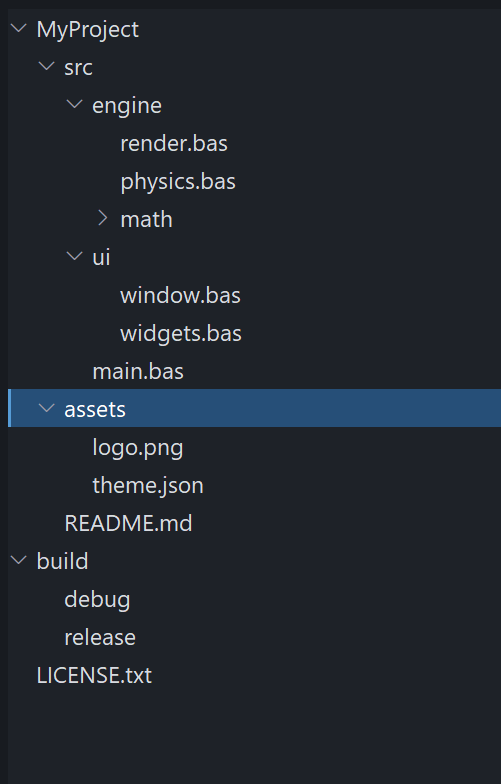
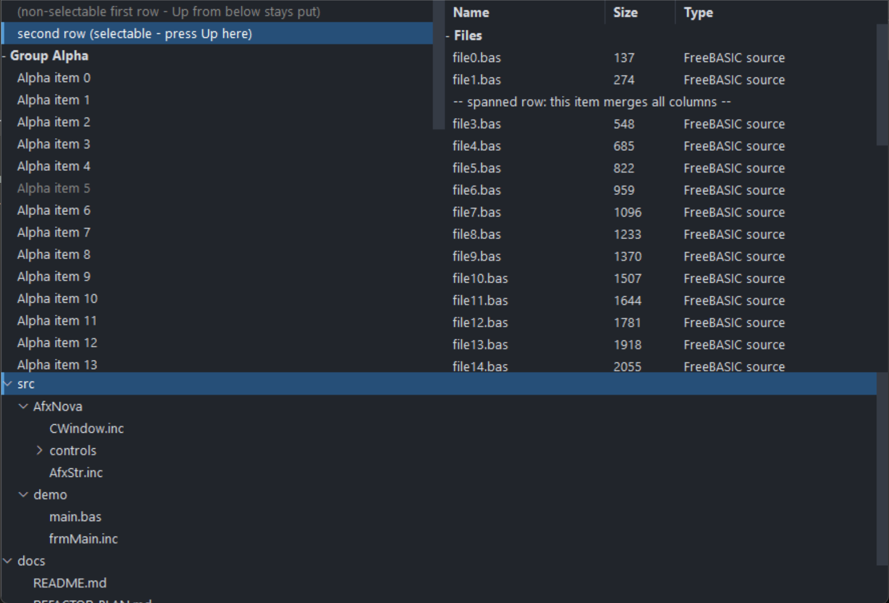

# PsListTree

An owner-drawn list **and tree** control for FreeBASIC Win32 applications: a scrolling list of
fixed-height rows that you paint yourself, with unlimited-depth **tree nodes**, control-drawn
expand/collapse twisties, **in-place label editing**, collapsible group headers, single /
multiple / extended selection, per-row tooltips, and an optional multi-column report mode driven
by a resizable header band.

The name says it: **PsListTree is a list box and a tree view in one control.** As a tree it does
what the traditional Win32 tree view (`SysTreeView32`) does — parent/child hierarchy of any
depth, `+`/`−` twisties, per-level indentation, Left/Right collapse and expand, and F2
rename-in-place with begin/end callbacks that mirror `TVN_BEGINLABELEDIT` / `TVN_ENDLABELEDIT`.
The differences are deliberate: it is **fully owner-drawn** (no visual-style dependency and every
row pixel is yours), nodes are addressed by plain **model index** rather than opaque `HTREEITEM`
handles, and a flat list, a grouped list and a deep tree are all the **same control** — a classic
header/item group is simply the depth-1 case. See *Tree view and in-place editing* below.

It is the control you reach for when a system `LISTBOX` or `SysTreeView32` almost fits but its
appearance does not — a file explorer pane, a results list, a symbol browser, an autocomplete
popup, a settings tree. There is no system control underneath: the whole surface is drawn in one
pass through a double buffer, so nothing about the look depends on the visual style the user
happens to be running.

The control owns three child windows for you — the row surface, an owner-drawn vertical
scrollbar that appears only while the rows overflow, and a column header band that starts
hidden. You never create or position any of them. What you supply is a row paint callback:
the control decides *which* rows are drawn, where they sit, and what state each is in, and you
decide what a row looks like.

Rows are addressed by **model index** — the order you added them. Collapsing a group hides
rows but never renumbers anything.

---

## What it looks like

**As a tree** — `tree_demo.exe`:



A multi-level tree built with `PsListTree_AddNode`: per-depth indentation, control-drawn chevron twisties (`˅` on expanded parents, `›` on the collapsed *math* node), leaf nodes with no twisty, the selected root with its focus bar, and F2 / click-to-rename editing. This is exactly the behaviour of a traditional tree view, drawn entirely by the control.

**As a list and a report** — `main.exe`:



The same control in its list modes. On the left a grouped single-column list — a collapsible group header, one selected row, and rows that keep their selection across a collapse. On the right, report mode: a `PsColumnHeader` band (Name / Size / Type), a group row, and an embedded `PsVScrollBar` down the right edge. Public indices in both are **model** indices; the visible index space never leaks out.

---

## Requirements

**Files to copy into your project:**

| File | Purpose |
|---|---|
| `PsListTree.bi` | Declarations — types, callbacks, constants, function prototypes |
| `PsListTree.inc` | Implementation |
| `PsColumnHeader.bi` / `.inc` | The column header band the control embeds — see [PsColumnHeader.md](PsColumnHeader.md) |
| `PsVScrollBar.bi` / `.inc` | The vertical scrollbar the control embeds |
| `PsBufferPaint.bi` / `.inc` | The flicker-free drawing surface everything paints through |
| `PsTipHost.bi` / `.inc` | The tooltip backend switch the control holds — not a control, no window of its own |
| `PsTooltip.bi` / `.inc` | The owner-drawn tooltip `PsTipHost` can drive instead of the system one |

All ten files are required even if you never define a column, never touch the scrollbar and
never leave the default system tooltip: the control creates both children unconditionally, and
`PsListTree.bi` / `.inc` include the tooltip pair themselves. They add **no include line of
their own** to your host — see *Include order* below.

**Only if you enable in-place label editing** (`PsListTree_EnableLabelEdit`), copy four more —
the editor is a `PsTextBox`, which uses `PsPopupMenu` for its right-click menu:

| File | Purpose |
|---|---|
| `PsTextBox.bi` / `.inc` | The single-line editor created over a row during a rename |
| `PsPopupMenu.bi` / `.inc` | The editor's context menu |

Include their implementations **before** `PsListTree.inc` (it calls into them), and add the pump
call under *In-place label editing*. A control that never enables editing needs none of this.

**AfxNova is required.** The control is built on `CWindow`, and `PsBufferPaint` draws through
`AfxNova\CGdiPlus.inc`. Sources include AfxNova relative to the workspace root
(`#include once "AfxNova\CWindow.inc"`), so builds need the workspace root on the include
path:

```bash
fbc64.exe -i "C:\dev" main.bas
```

**Include order — this one bites.** `PsListTree.bi` includes only `PsBufferPaint.bi`. It does
**not** include `PsVScrollBar.bi` or `PsColumnHeader.bi`, yet it names types from both:
`CVSCROLL_DEFAULT_WIDTH` and `VScrollPaintCallbackSub` from the scrollbar, and
`HDR_WidthChangedCallbackSub`, `HDR_ClickCallbackSub`, `HDR_AutoSizeCallbackFunc`,
`HDR_PaintCallbackSub` and `HDR_TooltipCallbackFunc` from the header. It therefore compiles
only at an include site that has already pulled those two in. Include the four implementation
files in exactly this order:

```freebasic
#include once "PsBufferPaint.inc"
#include once "PsVScrollBar.inc"
#include once "PsColumnHeader.inc"
#include once "PsListTree.inc"
```

If you enable label editing, add the editor's two implementations **before** `PsListTree.inc`:

```freebasic
#include once "PsBufferPaint.inc"
#include once "PsVScrollBar.inc"
#include once "PsColumnHeader.inc"
#include once "PsPopupMenu.inc"      ' editing only
#include once "PsTextBox.inc"        ' editing only
#include once "PsListTree.inc"
```

Get the order wrong and the errors point at `PsListTree.bi`, naming types rather than the
missing include.

`PsTipHost` and `PsTooltip` are **not** in either list on purpose. `PsListTree.bi` includes
`PsTipHost.bi` and `PsListTree.inc` includes `PsTipHost.inc` (which pulls in `PsTooltip.inc`),
so the four files must be present on disk but you never name them. Adding
`#include once "PsTooltip.inc"` yourself is harmless — the headers are `#pragma once` — and
equally unnecessary.

The AfxNova headers come first, before any of the above:

```freebasic
#include once "windows.bi"
#include once "AfxNova\CWindow.inc"
#include once "AfxNova\AfxStr.inc"
#include once "AfxNova\AfxGdiplus.inc"
using AfxNova
```

**GDI+ must be running before the first repaint and must outlive the last one.** All geometry
is rendered through GDI+, so bracket your message loop:

```freebasic
dim as ULONG_PTR gdipToken = AfxGdipInit()
' ... create windows, run the message loop ...
AfxGdipShutdown( gdipToken )
```

`AfxGdipShutdown` must come after every window is destroyed, because each repaint builds and
tears down a `PsBufferPaint`.

**Never name an identifier `ok`.** GDI+ defines `Ok = 0` as a `Status` enum value in namespace
`AfxNova`, and hosts customarily say `using AfxNova`. An existing variable, parameter or
function called `ok` becomes a duplicate definition the moment you adopt these files. Use
`bOK` instead.

**The message-pump filter is needed only for label editing.** If — and only if — you call
`PsListTree_EnableLabelEdit`, you must call `PsListTree_FilterMessage( @msg )` in your loop,
**ahead of `IsDialogMessage`** (see *Tree view and in-place editing*). Without editing there is
nothing to call, and the only pump requirement is the ordinary dialog-manager one below.

**For Tab navigation, call `IsDialogMessage` in your message pump.** The row surface is a
tabstop, and the container declares itself a control parent, so the dialog manager will step
into the control — but only if you give it the chance:

```freebasic
do while GetMessage( @uMsg, null, 0, 0 )
    if uMsg.message = WM_QUIT then exit do
    if IsDialogMessage( hWndForm, @uMsg ) = 0 then
        TranslateMessage @uMsg
        DispatchMessage @uMsg
    end if
loop
```

Without it, mouse operation and the keyboard are unaffected once the list has focus — only Tab
navigation is lost. The arrow keys are safe either way: the surface answers `WM_GETDLGCODE`
with `DLGC_WANTARROWS or DLGC_WANTCHARS`, so `IsDialogMessage` does not steal them for
tab-navigation.

**Give something the focus at startup.** `IsDialogMessage` acts only when the focused window is
already a descendant of the window you pass it. A real dialog does this in `WM_INITDIALOG`; an
ordinary window must call `SetFocus` on its first control itself. Skip it and the first Tab
does nothing, which is indistinguishable from the tabstops being broken. Clicking the list also
gives it focus, so this only affects a keyboard-first start.

---

## Quick start

```freebasic
' Create it. The control is created zero-sized and hidden; place it yourself.
dim as HWND hList = PsListTree_Create( hWndParent, IDC_MYFORM_LIST )
SetWindowPos( hList, 0, x, y, cx, cy, SWP_NOZORDER or SWP_SHOWWINDOW )

' You MUST supply a row painter -- without one, rows are not drawn at all.
PsListTree_SetPaintCallback( hList, @MyList_PaintRow )

' Optional: observe mouse messages, supply tooltips, hear about selection moves.
PsListTree_SetMessageCallback( hList, @MyList_Message )
PsListTree_SetTooltipCallback( hList, @MyList_Tooltip )
PsListTree_SetSelChangeCallback( hList, @MyList_SelChange )

' Appearance. The font is borrowed -- you keep ownership and destroy it yourself.
PsListTree_SetBackColor( hList, theme.BackColor )
PsListTree_SetFont( hList, ghFont(GUIFONT_10) )
PsListTree_SetScrollBarColors( hList, theme.BackColorScrollBar, _
                             theme.ForeColorScrollBar, theme.ForeColorScrollBarHot )

' Selection mode. Both off = single-select.
PsListTree_SetExtendedSelect( hList, true )     ' Shift ranges / Ctrl toggles

' Bulk load, batched: one map rebuild and one repaint instead of one per row.
PsListTree_BeginUpdate( hList )
PsListTree_AddHeader( hList, "Group Alpha" )
for i as integer = 0 to 20
    PsListTree_AddString( hList, "Alpha item " & i, 1000 + i )
next
PsListTree_EndUpdate( hList )

' Silent -- the SelChange callback does not fire for this.
PsListTree_SetCurSel( hList, 1 )
```

And the row painter:

```freebasic
sub MyList_PaintRow( byval p as PSLISTTREE_PAINTINFO ptr )
    ' State priority is yours to choose: selected > hot > normal is the usual one.
    dim as COLORREF backclr, foreclr
    if p->isSelected then
        backclr = theme.BackColorSelect : foreclr = theme.ForeColorSelect
    elseif p->isHot then
        backclr = theme.BackColorHot    : foreclr = theme.ForeColorHot
    else
        backclr = theme.BackColor       : foreclr = theme.ForeColor
    end if
    p->b->SetForeColor( foreclr )
    p->b->SetBackColor( backclr )
    p->b->PaintRect( @p->rc )          ' the whole row: selection spans it

    if p->isHeader then
        dim as DWSTRING wszPrefix
        if p->isCollapsed then wszPrefix = "+ " else wszPrefix = "- "
        p->b->SetFont( ghFont(GUIFONTBOLD_10) )
        p->b->PaintText( wszPrefix & p->wszCaption, @p->rc, DT_LEFT )
    else
        dim as RECT rcText = p->rc
        rcText.left += 16
        p->b->PaintText( p->wszCaption, @rcText, DT_LEFT )
    end if
end sub
```

That is the whole minimum. To turn on report mode, add columns and show the band:

```freebasic
PsListTree_AddColumn( hList, "Name", 160 )
PsListTree_AddColumn( hList, "Size", 70 )
PsListTree_AddColumn( hList, "Type" )              ' the fill column (default: the last)
PsListTree_SetHeaderPaintCallback( hList, @MyHeader_PaintColumn )
PsListTree_SetHeaderBackColor( hList, theme.BackColorScrollBar )
PsListTree_SetHeaderFont( hList, ghFont(GUIFONTBOLD_10) )
PsListTree_ShowHeader( hList, true )

' Cell text: column 0 IS the row's text; columns 1..N are per-row cells.
dim as integer r = PsListTree_AddString( hList, "file0.bas" )
PsListTree_SetCellText( hList, r, 1, "137" )
PsListTree_SetCellText( hList, r, 2, "FreeBASIC source" )
```

Your row painter then sees `p->columnCount > 0` and a `p->cells` array — fill the full row
background first, then draw each cell inside its own rect:

```freebasic
dim as integer pad = PsColumnHeader_GetPadding( PsListTree_GetHeader( hList ) )
for c as integer = 0 to p->columnCount - 1
    dim as RECT rcCell = p->cells[c].rc
    rcCell.left += pad : rcCell.right -= pad
    p->b->PaintText( p->cells[c].wszText, @rcCell, DT_LEFT or DT_END_ELLIPSIS )
next
```

---

## Concepts

### The handle is a real HWND

`PsListTree_Create` returns an ordinary window handle, and every `PsListTree_*` function takes it.
It is not an opaque type, so you can treat the control as the window it is — `SetWindowPos` to
place and size it, `ShowWindow` to show it, `GetDlgItem` to find it by the `CtrlID` you passed
at creation.

That handle is the **container**. It hosts three children: the row surface, the scrollbar and
the header band. Every function resolves them internally. Never pass a child handle to a
`PsListTree_*` function — results are undefined.

The children take consecutive control ids: the surface gets `CtrlID`, the scrollbar
`CtrlID + 1`, the header `CtrlID + 2`. Leave that much room around whatever id you pick.

### It is created zero-sized and hidden

`PsListTree_Create` gives the container the styles `WS_CHILD`, `WS_CLIPSIBLINGS` and
`WS_CLIPCHILDREN`. `WS_VISIBLE` is deliberately absent, so a newly created control shows
nothing until you size it and show it. That lets you build and configure the list — colours,
font, columns, contents — before it is ever seen.

### Row indices are model indices

Rows are addressed by the order they were added, independent of what is on screen. Collapsing a
group does **not** renumber anything, and hidden rows keep working with every row API,
selection included. Internally the control maps model rows to visible positions; that mapping
never leaks out. Everything you receive — `PSLISTTREE_PAINTINFO.itemID`,
`PSLISTTREE_MESSAGEINFO.idx`, `PsListTree_GetCurSel`, `PsListTree_GetSelItems`,
`PsListTree_GetTopIndex` — is a model index too.

`PsListTree_GetCount` is every row in the model. `PsListTree_GetVisibleCount` is the rows currently
on show. They differ exactly when something is collapsed.

### Groups, and trees

Every row carries a **tree level** (0 = top-level), so the control does hierarchies of any depth —
see *Tree view and in-place editing* below. The classic flat group is just the depth-1 case: a
header (`PsListTree_AddHeader`) is a level-0 parent and the items (`PsListTree_AddString`) after it
are its level-1 children, hidden when the header collapses. Build deeper structure with
`PsListTree_AddNode`. Collapsing any node hides its entire subtree.

Headers are ordinary rows in every other respect: they are selectable, they are returned by
`PsListTree_GetSelItems`, and they carry `itemData`. Use `PsListTree_IsHeader` to tell them apart —
"header" is now just a styling flag, independent of whether a node has children.

Clicking a header toggles its group and **leaves the selection alone** — a fold gesture, not a
select. (A plain `AddNode` parent instead toggles only via its twisty; the label selects.)

### Selection lives on the rows

Selection is a per-row flag in the model, not a bit inside a system listbox. That is what makes
it survive collapse and expand, and it is why a hidden row can be selected. Three modes, and
the two flags are mutually exclusive:

| Mode | How to get it | Mouse behaviour |
|---|---|---|
| Single | both off (the default) | Each click selects exactly one row |
| Extended | `PsListTree_SetExtendedSelect( h, true )` | Shift extends a range from the anchor, Ctrl toggles one row |
| Multiple | `PsListTree_SetMultiSelect( h, true )` | Every click toggles one row, checklist style |

Setting either mode clears the other. `PsListTree_GetCurSel` reports the **focused** row (the
caret), which is not the same as "the selection" once more than one row can be selected — use
`PsListTree_GetSelItems` for that.

### Everything is painted in one pass

One `WM_PAINT` on the surface fills the whole client with `BackColor` and then calls your paint
callback once per visible row, all into a single buffer. There is no per-row message and no
per-row buffer.

`p->rc` and the cell rects are in the **surface's client coordinates**, not in a row-sized
buffer starting at y = 0. Derive everything from `p->rc` and you never have to care.

Rows below the last one are not painted at all; the control's background already covers that
strip, which is why an empty list needs no special handling from you.

**If you set no paint callback, no rows are drawn** — only the background. That is the one
callback the control genuinely needs.

### The scrollbar manages itself

The control creates a `PsVScrollBar`, positions it on the right edge, keeps its range in step
with the model, and **auto-hides it whenever the rows fit** — at which point the row surface
reclaims the full client width. You never call `SetRange` or `SetPos`.

What is left to you is appearance: `PsListTree_SetScrollBarWidth`,
`PsListTree_SetScrollBarColors`, `PsListTree_SetScrollBarPaintCallback`, or
`PsListTree_GetScrollBar` for direct `PsVScrollBar_*` calls.

The mouse wheel is handled on the row surface, not by the bar: one notch scrolls
`SPI_GETWHEELSCROLLLINES` rows (re-read per message, and capped at one page), with the
sub-notch remainder accumulated so a precision touchpad scrolls smoothly rather than in jumps.
The thumb follows.

### Columns are optional, and the header band owns them

With no columns defined, the control paints as a single-column list and your painter sees
`p->columnCount = 0`.

Define columns and one thing changes: item rows arrive with a `cells` array giving each
column's x-span. **Group-header rows never get cells** — they always span the full width, so
`columnCount` is 0 for them regardless.

The column model lives in the embedded `PsColumnHeader`, which is the single store for widths,
minimums and the fill designation. The `PsListTree_*Column*` functions are wrappers that delegate
to it. See [PsColumnHeader.md](PsColumnHeader.md) for the width, minimum-width and fill rules.

**Column definitions and cell text are independent.** Cell storage is sparse and per row, so
you can populate rows before or after defining columns; a cell never set reads back `""`. The
band itself starts **hidden** — columns still lay out and rows still paint in columns, you
simply get no interactive header strip until `PsListTree_ShowHeader( h, true )`.

The header band spans the **full container width**, over the scrollbar strip, so column
geometry never shifts when the scrollbar auto-hides.

### Column 0 is the row's text

`PsListTree_GetText`/`SetText` and the cell functions with `col = 0` address the same storage.
Columns 1..N live in the row's own sparse cell array. This is why a list written before columns
existed keeps working unchanged.

Inserting or deleting a column shifts every row's cell storage across that alias — insert a
column at 0 and each row's text becomes its column 1 cell.

### Spanned rows

An ordinary, selectable row can be made to paint as **one cell across the whole column band**
instead of one cell per column — `PsListTree_SetRowSpanColumns( h, row, true )`. Use it for a
section note, a "no results" line, or any wide message row that lives among columned rows.

Its text stays in **column 0** (`PsListTree_GetText` / `GetCellText( h, row, 0 )`). At paint time
the callback receives `p->columnCount = 1` with `p->isSpanned = true`; `cells[0].rc` runs from
column 0's own left to the last column's right (the same left a normal column-0 cell gets, so
the spanned text lines up under column 0), and `cells[0].wszText` is the column-0 text. A painter
that already loops `for c = 0 to columnCount - 1` draws it correctly with **no new branch** — it
simply draws one wide cell. Selection and hover still fill the full `p->rc`, and the row selects,
hot-tracks and keyboard-navigates like any other.

Two details worth knowing:

- With **no columns defined**, a spanned row is already full-width (`columnCount = 0`); the flag
  only advertises the intent via `p->isSpanned`.
- A spanned row is **exempt from the column-shift** above: inserting or deleting a column never
  moves its text out of column 0, so its caption cannot be silently blanked.

Group headers are **not** spanned rows — they have their own `isHeader` path and carry
`isSpanned = false`.

### Drag-and-drop reordering

Opt in with `PsListTree_SetDragReorder( h, true )` (default **OFF**) and the user can drag rows to
new positions inside the same list:

- **What drags** — press an item and move past the system drag threshold. If the pressed row is
  part of a multi-selection, the **whole selection** moves (gathered contiguously at the drop,
  keeping its relative order, even if it was non-contiguous); otherwise just that one row.
  Headers and non-selectable rows are never draggable.
- **Where it drops** — a horizontal insertion line shows the target gap. Dropping **on a header**
  highlights it and inserts the block as that header's **first children** (a collapsed header
  expands on drop). Because grouping is positional, a row dropped into another group simply
  belongs to it afterward.
- **Feedback** — the insertion line / header highlight paints in `SetDragIndicatorColor` (accent
  blue by default). Dragging near the top/bottom edge **auto-scrolls** so off-screen targets are
  reachable. **Esc** — or any loss of mouse capture — cancels the drag with no move.

The control moves its **own** model and fires two optional callbacks: **`CanDrop`** just before
(return FALSE to reject — it receives the source rows and the drop-target row's `ROWINFO`), and
**`DragDrop`** just after (the block's new first row and count, so you can resync parallel data
via `itemData`). This is the only gesture in the control that takes mouse **capture**, and only
while a drag is actually in progress.

`PsListTree_MoveRows( h, srcRows(), insertBefore )` performs the same reorder programmatically —
**silent** (no `DragDrop`), like every other setter.

### Non-selectable rows

A row can be made **non-selectable** — `PsListTree_SetRowSelectable( h, row, false )`. It then
cannot be selected or focused **by any path**, and keyboard navigation skips over it:

- **Mouse** — clicking it changes nothing (no selection, no focus). The host still sees the
  raw click through the message callback.
- **Keyboard** — arrows, PageUp/Down, Home and End step past it to the nearest selectable row.
  A single-step arrow that would only reach non-selectable rows leaves the caret where it is;
  the paging and Home/End keys always land on *some* selectable row if one exists.
- **Programmatic** — `SetCurSel` returns -1 and no-ops, `SetSel( …, true )` returns FALSE,
  `SelectAll` skips it, and a Shift-range selects every selectable row it spans but not this one.

The rule is a hard invariant: a non-selectable row is *never* selected and *never* focused. If
you mark a row non-selectable while it is the current/selected row, its selection is cleared and
the caret is dropped (silent, repaints). To select it again, clear the flag first.

The paint callback gets `p->isSelectable`, so a painter can grey the row — that is cosmetic; the
control does the blocking regardless of how you draw it. The flag is independent of the others: a
row can be spanned and non-selectable at once (a section note that fills the width and can't be
picked).

### Batch bulk changes

Every model mutator rebuilds the visible map and repaints. Wrap a bulk load in
`PsListTree_BeginUpdate` / `PsListTree_EndUpdate` and that collapses to one rebuild and one
repaint, turning an O(n²) load into O(n). The pairs nest.

### Programmatic changes are silent

`PsListTree_SetCurSel`, `SetSel`, `SelectAll` and `Clear` never fire the SelChange callback. It
reports **user** action only — a click, or a keyboard move. This follows Win32's own
`LB_SETCURSEL` / `LBN_SELCHANGE` split, and it means you can call the setters from inside your
own handler without recursing.

The same rule holds for column widths: `PsListTree_SetColumnWidth` repaints but fires no resize
callback. Only a user drag or an autosize notifies.

### Pixels, and who scales them

| Setting | Unit | Default |
|---|---|---:|
| Row height (`PsListTree_SetRowHeight`) | **Unscaled** — DPI-scaled internally | 22 |
| Header height (`PsListTree_SetHeaderHeight`) | **Unscaled** — DPI-scaled internally | 24 |
| Scrollbar width (`PsListTree_SetScrollBarWidth`) | **Unscaled** — DPI-scaled at layout | 12 |
| Column widths and minimums | **Pixels**, used as given | 100 / 0 |
| Header caption padding | **Pixels** after create; the default is DPI-scaled at create | 8 |

Row height and header height are the trap in both directions: hand them a value you have
already scaled and it gets scaled twice.

### Keyboard

The row surface handles these itself and consumes them, so they never reach the message
callback:

| Key | Action |
|---|---|
| Up / Down | Move the focus one visible row |
| PageUp / PageDown | Move the focus one page |
| Home / End | First / last visible row |
| Left | Collapse an expanded header; from an item, jump to its header |
| Right | Expand a collapsed header; from an expanded one, step to the first child |
| Space | Toggle the focus row's selection (multiple / extended), or select it (single) |

Shift and Ctrl modify the arrow and page moves the same way they modify a click. Because
`WM_KEYDOWN` never reaches the message callback, **`SelChangeCallback` is the only way to
observe keyboard navigation.**

Every move ensures the new focus row is on screen.

### Hover, tooltips and focus

Exactly one row is hot at a time. Hover state is cleared both by `WM_MOUSELEAVE` and by a
100 ms cursor poll, because `WM_MOUSELEAVE` is not reliably delivered on fast exits.

Tooltips are resolved on demand: with no tooltip callback the hovered row's own text is used;
with one, whatever it returns, and `""` suppresses the tip entirely. The tip is popped when the
hot row changes so the next hover re-queries.

The tip is drawn by the **system** tooltip unless you move the instance onto the owner-drawn
`PsTooltip` with `PsListTree_SetTooltipMode`. That choice changes only the drawing and the
timing — never the text, which comes from the rule above either way. See *Tooltips* under the
API reference.

A left click calls `SetFocus` on the row surface **before** your message callback runs. If the
list must not hold focus — an autocomplete popup over an editor, say — put the focus back from
your callback.

### Lifetime

The control frees itself, its tooltip and all three children when its window is destroyed.
Fonts you pass in stay yours: the control stores the `HFONT` and never destroys it.

---

## Tree view and in-place editing


The same control, driven as a treeview: unlimited depth, control-drawn twisties, per-depth
indent, and label editing. `tree_demo.exe` (build it with `build_tree.bat`) is a focused harness
for exactly these features; `main.exe` (from `build.bat`) exercises everything else.

Every row carries a **tree level** (0 = top-level), and the tree lives in ordinary array order: a
node's whole subtree is the contiguous run of deeper-level rows right after it, so parent, child
count and "has children" are all derived — there is no separate tree object to keep in sync.
Collapsing a node hides its entire subtree, at any depth. The old flat header/item model is just
the **depth-1** case of this, so nothing about the existing API changed.

### Building a tree

`PsListTree_AddNode( h, parentRow, Text )` appends a child under `parentRow` (`-1` = a new
top-level node); `PsListTree_InsertNode` places one at a specific child position. Query the shape
with `PsListTree_GetLevel` / `GetParent` / `GetChildCount` / `HasChildren`.

```freebasic
dim as integer proj = PsListTree_AddNode( hTree, -1,   "MyProject" )
dim as integer src  = PsListTree_AddNode( hTree, proj, "src" )
                      PsListTree_AddNode( hTree, src,  "main.bas" )
dim as integer eng  = PsListTree_AddNode( hTree, src,  "engine" )
                      PsListTree_AddNode( hTree, eng,  "render.bas" )
```

### Twisties and indentation are opt-in

Both default **OFF**, so a control that only builds flat lists or legacy groups is visually
unchanged. Turn them on for a tree:

```freebasic
PsListTree_SetTreeIndent( hTree, true )         ' indent column 0 by depth
PsListTree_ShowTwisty( hTree, true )            ' control draws the chevron + owns its hit-rect
PsListTree_SetTwistyFont( hTree, hSymbolFont )  ' a Segoe Fluent Icons HFONT
```

With the twisty on, clicking it toggles the node **without** touching the selection; clicking the
label selects. (A legacy `AddHeader` row keeps its whole-row toggle.) In your row painter, draw
your column-0 text at `p->rc.left + p->indent` (that offset already includes the reserved twisty
band, so parents and leaves at the same depth line up). Only column 0 is indented — other columns
keep their x. To draw your **own** glyph instead of the built-in chevron, call `ShowTwisty(false)`
and read `p->rcTwisty` / `p->level` / `p->hasChildren` / `p->isExpanded`.

Keyboard: **Left** collapses an expanded node or jumps to its parent; **Right** expands a
collapsed node or steps to its first child — at any depth.

### In-place label editing

Opt in with `PsListTree_EnableLabelEdit( h, true )`. An edit starts on **F2** (on the focused row),
on `PsListTree_BeginEdit`, or — with `PsListTree_SetClickToEdit( h, true )` — on a click of the
row that is already current (explorer rename). **Enter commits, Esc cancels, clicking away
commits.** The editor is a single-line `PsTextBox` created over the caption and destroyed on
commit or cancel.

**Any column is editable, but only one has a gesture.** F2, Enter and click-to-edit all open
whichever column `PsListTree_SetEditColumn` names — column 0, the caption, by default. To edit a
different column from a click, resolve which one the click landed in with
`PsListTree_GetColumnRect` from your message callback and call `PsListTree_BeginEdit( h, row,
col )`, which is never constrained by the gesture column. Enter opens an editor only when
`PsListTree_SetEnterEdits( h, true )` is on; it is off by default because claiming Enter would
otherwise take it from your dialog's default button.

Theme the editor with `PsListTree_SetEditColors` — the control creates it lazily and owns it, so
there is no handle for you to reach, and without this it renders black on white whatever the list
around it looks like. `PsListTree_SetEditTextInset` lines its text up with the inset your painter
uses for cell text, and `PsListTree_SetEditSelectAll( h, false )` puts the caret at the end
instead of selecting everything.

> **Pump obligation.** A host that enables editing MUST call `PsListTree_FilterMessage( @msg )` in
> its message loop, **ahead of `IsDialogMessage`** — otherwise `IsDialogMessage` eats Enter (as
> "press the default button") and Esc (as "cancel") before they reach the editor. A host that
> never enables editing needs no pump call.

```freebasic
do while GetMessage( @msg, null, 0, 0 )
    if msg.message = WM_QUIT then exit do
    if PsListTree_FilterMessage( @msg ) then continue do      ' editing hosts: BEFORE IsDialogMessage
    if IsDialogMessage( hWnd, @msg ) = 0 then
        TranslateMessage( @msg ) : DispatchMessage( @msg )
    end if
loop
```

`BeginLabelEdit` can veto an edit before it starts; `EndLabelEdit` receives the new text and can
reject it (the row keeps its old caption). Register both under *Callback registration*; the
typedefs are in *Callbacks*.

---

## Behaviour and limits

Firm properties of the control, not settings:

- **Nothing is drawn without a paint callback.** The background is filled, and that is all.
- **All rows are the same height.** There is no per-row height, so a group header cannot be
  taller than its items.
- **Legacy group headers do not nest**, though tree nodes do. `AddHeader` + `AddString` builds a
  depth-1 group that runs to the next header; for real depth use `AddNode` / `InsertNode`.
- **The data setters do not repaint; the text setters do.** `PsListTree_SetText` and
  `SetCellText` invalidate (coalesced by `BeginUpdate` / `EndUpdate`, so a wrapped bulk load
  still costs one repaint). `SetItemData` and `SetItemDataExtra` change the model and return —
  they draw nothing, which is right, since neither is on screen unless your painter puts it
  there. Call `PsListTree_Refresh` if yours does.
- **`PsListTree_SetBackColor` does not repaint either.** It stores the colour and returns the
  previous one. Set it before showing the control, or follow it with `PsListTree_Refresh`.
- **Group-header rows never receive cells.** They span the full width even in report mode, so
  `columnCount` is 0 for them.
- **The control does not clip between cells.** Cell rects are handed to you as computed;
  drawing text wider than its cell will spill into the next one. `DT_END_ELLIPSIS` is the
  answer.
- **The control never sorts.** `PsListTree_SetColumnClickCallback` is the hook; reordering the
  rows is yours.
- **The `cells` pointer is valid only during the paint callback.** It points at control-owned
  scratch reused for every row. Copy anything you need to keep.
- **Cell text survives `PsListTree_ClearColumns`.** Clearing column *definitions* does not clear
  row *data* — the two are deliberately independent.
- **`PsListTree_GetColumnWidth` on the fill column returns its laid-out width**, not the stored
  one. Setting a width on the fill column stores it but has no visual effect until that column
  stops being the fill.
- **The message callback's return value has no effect for the button messages.** For
  `WM_LBUTTONDOWN`, `WM_LBUTTONUP`, `WM_RBUTTONDOWN` and `WM_LBUTTONDBLCLK` the surface
  consumes the message either way, and for the button-down the control's own selection or
  collapse handling has **already run** by the time you are called. Returning TRUE suppresses
  `DefWindowProc` only for `WM_MOUSEMOVE`, `WM_MOUSEHOVER`, `WM_MOUSELEAVE` and
  `WM_MOUSEWHEEL`.
- **`PSLISTTREE_MESSAGEINFO.idx` is filled only for the button and hover messages.** It stays -1
  for `WM_MOUSEMOVE`, `WM_MOUSELEAVE` and `WM_MOUSEWHEEL`.
- **Clicks that land below the last row do not reach the message callback at all**, for any
  button message.
- **The wheel is reported only when it actually scrolls.** A wheel gesture against the end of
  the list does not call the message callback.
- **The header band's own `WidthChanged` slot belongs to the control.** Subscribe with
  `PsListTree_SetColumnResizeCallback`, never with `PsColumnHeader_SetWidthChangedCallback` on the
  handle from `PsListTree_GetHeader`. Every other header callback passes straight through.
- **No horizontal scrolling.** Columns wider than the client run off the right edge and are
  clipped there.
- **No checkbox column, no icons.** Anything of that kind is drawn by your painter and driven by
  your message callback. (In-place editing and drag-reorder *are* built in, both opt-in.)
- **Only one column has an editing gesture.** F2, Enter and click-to-edit all open whichever
  single column `PsListTree_SetEditColumn` names (default 0). Editing any other column is
  programmatic: resolve the clicked column with `PsListTree_GetColumnRect` and call
  `PsListTree_BeginEdit` with it.
- **Switching tooltip backend cannot change what a tip says.** Both backends resolve text
  through the same rule — your tooltip callback if set, otherwise the row's own text. The
  backend decides only how the tip is drawn and driven.

---

## API reference

Every function takes the handle from `PsListTree_Create` as its first argument, written `h` in
the tables below.

### Creation

| Function | Description |
|---|---|
| `PsListTree_Create( hWndParent, CtrlID ) as HWND` | Creates the control as a child of `hWndParent` and returns the container's handle. `CtrlID` becomes its `GWLP_ID`; the three children take `CtrlID`, `CtrlID + 1` and `CtrlID + 2`. Created zero-sized and hidden — place it with `SetWindowPos`. |

### Content

`Add*` and `Insert*` return the new row's **model index**, or -1 on failure.

| Function | Description |
|---|---|
| `PsListTree_AddString( h, Text, itemData = 0, itemDataExtra = 0 ) as integer` | Appends an item row. |
| `PsListTree_AddHeader( h, Text, itemData = 0, itemDataExtra = 0 ) as integer` | Appends a group-header row. Items added after it belong to this group until the next header. |
| `PsListTree_InsertString( h, row, Text, itemData = 0, itemDataExtra = 0 ) as integer` | Inserts an item at `row`, shifting later rows down. `row` is clamped to `[0, count]` and the index actually used is returned. Inserts an **item**, never a header. |
| `PsListTree_AddNode( h, parentRow, Text, itemData = 0, itemDataExtra = 0 ) as integer` | Appends a child under `parentRow` (`-1` = a new top-level node), after the parent's whole existing subtree, at `parent.level + 1`. Returns the new model index, or -1. See *Tree view and in-place editing*. |
| `PsListTree_InsertNode( h, parentRow, childIndex, Text, itemData = 0, itemDataExtra = 0 ) as integer` | Inserts among `parentRow`'s direct children at `childIndex` (clamped; past the end appends). `parentRow = -1` inserts a top-level node. Returns the new model index, or -1. |
| `PsListTree_DeleteString( h, row ) as boolean` | Deletes the one row. FALSE for an invalid index. To remove a whole subtree, delete the parent's descendants first (see `GetChildCount` / `GetLevel`). |
| `PsListTree_Clear( h )` | Removes every row. Also resets the focus and anchor rows to -1, so a stale caret cannot survive into the next list. Silent. |
| `PsListTree_GetCount( h ) as integer` | Every row in the model. |
| `PsListTree_GetVisibleCount( h ) as integer` | Rows currently on show — headers plus the items of expanded groups. |
| `PsListTree_GetText( h, row ) as DWSTRING` | The row's text, which is also its column 0 cell. `""` for an invalid row. |
| `PsListTree_SetText( h, row, Text ) as boolean` | Sets it. FALSE for an invalid row. **Does not repaint** — call `PsListTree_Refresh` if the list is on screen. |
| `PsListTree_GetCellText( h, row, col ) as DWSTRING` | Column `col`'s text for that row. `col = 0` is the row's own text. A cell never set — and any `col` beyond what the row stores — reads `""`, as does a negative `col`. |
| `PsListTree_SetCellText( h, row, col, Text ) as boolean` | Sets it, growing the row's sparse cell storage as needed. FALSE for an invalid row or a negative `col`. A `col` beyond the defined columns is legal storage: it simply paints once a matching column exists. **Does not repaint.** |
| `PsListTree_GetItemData( h, row ) as integer` | The row's user value. 0 for an invalid row. |
| `PsListTree_SetItemData( h, row, itemData ) as boolean` | Sets it. FALSE for an invalid row. **Does not repaint.** |
| `PsListTree_GetItemDataExtra( h, row ) as integer` | The row's second user value. |
| `PsListTree_SetItemDataExtra( h, row, itemDataExtra ) as boolean` | Sets it. FALSE for an invalid row. **Does not repaint.** |
| `PsListTree_BeginUpdate( h )` | Suspends the rebuild-and-repaint that every model mutator would otherwise do. Nests. |
| `PsListTree_EndUpdate( h )` | Ends one nesting level; the outermost one refreshes once. |
| `PsListTree_Refresh( h )` | Rebuilds the visible map, re-derives the scroll position and the scrollbar, and repaints with a background erase. |

### Groups and trees

Collapse, expand and toggle act on anything that **can** fold — a legacy header or any node with
children — and return FALSE for a leaf or an invalid index. The tree queries read the derived
structure and work whether the nodes were built with `AddNode` or with `AddHeader`/`AddString`.

| Function | Description |
|---|---|
| `PsListTree_IsHeader( h, row ) as boolean` | Is this row a group header (a styling flag)? |
| `PsListTree_IsCollapsed( h, row ) as boolean` | Is this node collapsed? |
| `PsListTree_CollapseRow( h, row ) as boolean` | Collapses the node, hiding its whole subtree. TRUE for any foldable node; only an actual change refreshes. |
| `PsListTree_ExpandRow( h, row ) as boolean` | Expands the node, same convention. |
| `PsListTree_ToggleRow( h, row ) as boolean` | Flips it. |
| `PsListTree_SetNodeCollapsed( h, row, bCollapsed ) as boolean` | Sets the collapsed state directly. FALSE for a leaf or invalid row. **Silent.** |
| `PsListTree_CollapseAll( h ) as boolean` | Collapses every foldable node in one refresh. |
| `PsListTree_ExpandAll( h ) as boolean` | Expands every foldable node in one refresh. |
| `PsListTree_GetLevel( h, row ) as integer` | The node's tree depth (0 = top-level), or -1 for an invalid row. |
| `PsListTree_GetParent( h, row ) as integer` | The model index of the node's parent, or -1 for a top-level node / invalid row. |
| `PsListTree_GetChildCount( h, row ) as integer` | Number of **direct** children. |
| `PsListTree_HasChildren( h, row ) as boolean` | Whether the node has any children. |

### Selection and state

| Function | Description |
|---|---|
| `PsListTree_GetCurSel( h ) as integer` | The **focused** row's model index, or -1. |
| `PsListTree_SetCurSel( h, row ) as integer` | Focuses `row`, selects only it, sets the anchor there, and scrolls it into view if it is off-page. Returns `row`. An invalid index instead clears the whole selection and the focus and returns -1. **Silent** — the SelChange callback does not fire. A row hidden under a collapsed header keeps the focus but does not scroll. |
| `PsListTree_GetSel( h, row ) as boolean` | Is that row selected? Works for hidden rows and headers. |
| `PsListTree_SetSel( h, row, state ) as boolean` | Sets one row's selected flag and repaints. FALSE for an invalid row. Does not move the focus. **Silent.** |
| `PsListTree_GetSelCount( h ) as integer` | How many rows are selected, hidden ones included. |
| `PsListTree_GetSelItems( h, selItems() ) as integer` | Redims `selItems()` to the model indices of every selected row, ascending, and returns the count. With nothing selected the array is erased and 0 returned. |
| `PsListTree_SelectAll( h, state )` | Sets every row's selected flag to `state` and repaints. **Silent.** |
| `PsListTree_SetMultiSelect( h, enable ) as boolean` | Checklist mode: every click toggles one row. Enabling it turns extended mode off. |
| `PsListTree_SetExtendedSelect( h, enable ) as boolean` | Explorer mode: Shift extends a range from the anchor, Ctrl toggles. Enabling it turns multiple mode off. |
| `PsListTree_PreventDoubleClick( h, enable = true ) as boolean` | Opts out of double-click reporting. With `CS_DBLCLKS` a double-click delivers down, up, **dblclk**, up — the dblclk substituting for the second down — so a host acting on `WM_LBUTTONUP` acts twice. Enabled, the dblclk still applies the ordinary click to the model (selection, header toggle) but is never surfaced, and the trailing second up is swallowed too: you see exactly one down/up pair per double-click. |
| `PsListTree_GetTopIndex( h ) as integer` | The model index of the first displayed row, or -1 when nothing is visible. |
| `PsListTree_SetTopIndex( h, row ) as integer` | Scrolls so `row` is at the top. A row hidden under a collapsed header resolves to its group header, so any valid model row may be passed without checking collapse state. The scroll is clamped — never past the point where the last row sits at the bottom of the viewport — and the **clamped** result is returned. -1 for an invalid row. |

### Drag-and-drop reordering

Opt-in; see the *Drag-and-drop reordering* concept above. Register the callbacks with the
functions under *Callback registration*.

| Function | Description |
|---|---|
| `PsListTree_SetDragReorder( h, enable = true ) as boolean` | Turns drag-reorder on or off (default OFF). Turning it off also cancels any drag in progress. |
| `PsListTree_GetDragReorder( h ) as boolean` | Whether drag-reorder is enabled. |
| `PsListTree_MoveRows( h, srcRows() as integer, insertBefore ) as integer` | Moves the given MODEL rows so they land contiguously before `insertBefore` (a MODEL index; `GetCount()` appends). Sources may be non-contiguous and any order; they are de-duplicated, kept in original relative order, and **headers among them are ignored**. Selection travels with each row. The moved block becomes the focus/anchor. Returns the block's new first index, or -1 if nothing moved. **Silent** (no `DragDrop`); repaints. |
| `PsListTree_SetDragIndicatorColor( h, clr ) as COLORREF` | Sets the insertion-line / header-highlight colour and returns the previous one. |
| `PsListTree_GetDragIndicatorColor( h ) as COLORREF` | The current indicator colour. |

### Appearance

| Function | Description |
|---|---|
| `PsListTree_GetBackColor( h ) as COLORREF` | The colour behind the rows, including the strip below the last one. |
| `PsListTree_SetBackColor( h, clr ) as COLORREF` | Sets it and returns the previous value. **Does not repaint** — set it before showing, or follow with `PsListTree_Refresh`. |
| `PsListTree_GetRowHeight( h ) as integer` | The row height in **unscaled** units. |
| `PsListTree_SetRowHeight( h, height ) as integer` | Sets it and returns what you passed. Unscaled units — the control DPI-scales it, so do not pre-scale. Repaints and re-syncs the scrollbar, since rows-per-page changed. The scaled result is floored at 1 pixel. |
| `PsListTree_GetFont( h ) as HFONT` | The font selected into the buffer before each row callback. |
| `PsListTree_SetFont( h, hFont ) as boolean` | Sets it and repaints. **Borrowed, never owned** — keep it alive and destroy it yourself. Your paint callback may select a different font per row. |

### Tooltips

The control ships on the **system** tooltip (comctl32) and stays there unless you ask
otherwise. `PsListTree_SetTooltipMode( h, PSTIP_MODE_PS )` moves that one instance onto
`PsTooltip` instead: owner-drawn and themeable, it word-wraps to a maximum width without a
hand-sent `TTM_SETMAXTIPWIDTH`, and it does not subclass the control it serves.

The default is deliberate rather than timid — `PsTooltip`'s colour defaults are dark and the
system tip is light, so a control that switched on its own would put a dark tip on a light form.

Switching backend does **not** change what a tip says. Text resolution is the same either way:
your `TooltipCallback` if one is set, otherwise the row's own text, with `""` suppressing the
tip. Only the drawing and the driving differ.

| Function | Description |
|---|---|
| `PsListTree_SetTooltipMode( h, nMode ) as boolean` | `PSTIP_MODE_SYSTEM` (default) or `PSTIP_MODE_PS`. Destroys the outgoing tip, builds the incoming one and re-applies the stored delays. A no-op when the mode is already the one asked for. Returns TRUE if the requested mode is live on return. |
| `PsListTree_GetTooltipMode( h ) as long` | The current mode. `PSTIP_MODE_SYSTEM` for an invalid handle. |
| `PsListTree_GetTooltipHandle( h ) as HWND` | The comctl32 tooltip window, for direct `TTM_*` messages — and **0 while the instance is on `PsTooltip`**, since a `TTM_*` sent to a `PsTooltip` window is silently ignored. |
| `PsListTree_GetPsTooltipHandle( h ) as HWND` | The reverse: the `PsTooltip` window, and 0 on the system backend. This is the door to `PsTooltip_SetColors` / `SetFonts` / `SetStyle` / `SetMaxWidth` / `SetTitle` / `SetGlyph`, which are deliberately **not** mirrored on this control. |
| `PsListTree_SetHoverTime( h, milliseconds )` | The initial dwell — how long the cursor must rest on a row before a tip appears. Default 250. **Double duty:** the same value is `TrackMouseEvent`'s `dwHoverTime`, so this also decides when the control considers a row hot. |
| `PsListTree_SetAutoPopTime( h, milliseconds )` | How long a shown tip stays up before it hides itself. |
| `PsListTree_SetReshowTime( h, milliseconds )` | The delay before a tip reappears when the cursor moves to another row while a tip is already up. |

All three delays are honoured by **both** backends, and are stored rather than pushed straight
at the live tooltip, so a delay set before a mode switch is still in force after it. A delay you
never set keeps the backend's own value, derived from the system double-click time. A delay set
to 0 is a real request for "no delay" and survives a switch as such.

#### Theming every tip at once

Per-instance theming through `GetPsTooltipHandle` works, but it is rarely what you want. The
intended way to use `PSTIP_MODE_PS` is to set the process-wide defaults **before any control is
created**, so every tip in the application matches without the host tracking handles:

```freebasic
dim as PSTOOLTIP_COLORS tipColors
tipColors.BackColor = theme.BackColor
tipColors.ForeColor = theme.ForeColor
PsTooltip_SetDefaultColors( @tipColors )
PsTooltip_SetDefaultFonts( ghFont(GUIFONT_9), ghFont(GUIFONTBOLD_10), ghFont(SYMBOLFONT_10) )
PsTooltip_SetDefaultMaxWidth( 320 )
PsTooltip_SetDefaultDelays( 400, 8000, 100 )

' ... then create the control and opt it in:
PsListTree_SetTooltipMode( hList, PSTIP_MODE_PS )
```

`PsTooltip_SetDefaultStyle` is available on the same footing, and `PsTooltip_ClearDefaults`
disarms the lot. The fonts are **borrowed**: you keep ownership and must outlive every tip that
uses them — the one real hazard here, since you are promising them to controls you never see.
See `PsTooltip.bi` for the colour struct and the style constants.

### Border

Off by default. Switch it on to give the list the same chrome a `PsTextBox` has, so a list
and a text field stacked on one settings page read as the same kind of control:

```freebasic
PsListTree_SetBorderColor( hList, PsTextBox_GetBorderColor( hField ) )
PsListTree_SetBorderWidth( hList, 1 )
```

The frame is drawn by the control's outer window, and the row surface, the scrollbar strip
and the column header band are all inset by the width, so nothing paints over it. Corners are
square, matching a `PsTextBox` at its default corner radius of 0.

The width is in **raw pixels and is never DPI-scaled** — a chrome hairline should stay a
hairline at every scale (the same rule `PsTextBox`'s border and `PsMenuBar`'s separator
follow). Do not pre-scale it.

There is no focus-border colour. A `PsTextBox` switches to one when its editor has the caret;
a list has no caret to signal.

| Function | Description |
|---|---|
| `PsListTree_GetBorderWidth( h ) as integer` | Pixels. 0 (the default) means no border and no reserved space. |
| `PsListTree_SetBorderWidth( h, nWidth )` | Sets it, re-lays out the children and repaints. Negative clamps to 0. Raw pixels — not DPI-scaled. |
| `PsListTree_GetBorderColor( h ) as COLORREF` | Default `BGR(122,122,122)`, the same default `PsTextBox` uses. |
| `PsListTree_SetBorderColor( h, clr )` | Sets it and repaints. |
| `PsListTree_ProbeRenderedPixel( h, x, y ) as long` | Renders the outer window offscreen through the same code its `WM_PAINT` runs and returns the colour at one client point as a `COLORREF`, or `-1` if the point is outside the client. For asserting that a themed border actually reached the pixels rather than merely that the setter stored it. Renders the outer window only — the rows live on a child surface and are not in that image. |

### Tree appearance

All OFF / zero-effect by default, so a flat or grouped list is untouched. Widths are **unscaled**
units, DPI-scaled internally. See *Tree view and in-place editing*.

| Function | Description |
|---|---|
| `PsListTree_SetTreeIndent( h, enable = true ) as boolean` | Turns per-depth indentation of column 0 on/off. |
| `PsListTree_GetTreeIndent( h ) as boolean` | Whether tree indent is on. |
| `PsListTree_SetIndentWidth( h, nWidth ) as integer` | Per-level indent in unscaled units (default 16). Returns the stored value; repaints. |
| `PsListTree_GetIndentWidth( h ) as integer` | The per-level indent width. |
| `PsListTree_ShowTwisty( h, enable = true ) as boolean` | Has the control draw the expand/collapse chevron and own its hit-rect. |
| `PsListTree_IsTwistyShown( h ) as boolean` | Whether the twisty is shown. |
| `PsListTree_SetTwistyWidth( h, nWidth )` | Reserved twisty-band width in unscaled units (default 16). |
| `PsListTree_SetTwistyColor( h, clr )` | The glyph colour. |
| `PsListTree_SetTwistyFont( h, hFont )` | The symbol font for the glyph, borrowed not owned — a Segoe Fluent Icons `HFONT`. |
| `PsListTree_SetTwistyGlyphs( h, wszExpanded, wszCollapsed )` | Overrides the two glyphs (default ChevronDown / ChevronRight). |

### In-place label editing

Opt-in. **Enabling it establishes a pump obligation:** call `PsListTree_FilterMessage` in the loop,
before `IsDialogMessage`. See *Tree view and in-place editing*.

| Function | Description |
|---|---|
| `PsListTree_EnableLabelEdit( h, enable = true ) as boolean` | Turns label editing on/off. Turning it off ends any edit in progress (as a cancel). |
| `PsListTree_IsLabelEditEnabled( h ) as boolean` | Whether editing is enabled. |
| `PsListTree_SetClickToEdit( h, enable = true ) as boolean` | When on (default OFF), a click on the already-current row starts an edit. |
| `PsListTree_SetEditColumn( h, col ) as boolean` | Which single column F2, Enter and click-to-edit open. Default 0 (the caption); negatives clamp to 0. Does **not** constrain `BeginEdit`, which always names its own column. |
| `PsListTree_GetEditColumn( h ) as integer` | That gesture column. 0 for an invalid handle. |
| `PsListTree_SetEnterEdits( h, enable = true ) as boolean` | Enter starts an edit on the focused row. Default **OFF**, and opt-in separately from `EnableLabelEdit` because claiming Enter is not free — the control has to answer `WM_GETDLGCODE` with `DLGC_WANTALLKEYS` for that one message, or `IsDialogMessage` hands Enter to your default button first. Leave it off if Enter means something else in your dialog. It **wins over** `SetActivateCallback`: a list whose Enter opens an editor does not also activate. |
| `PsListTree_SetEditColors( h, clrBack, clrFore, clrBorder, clrFocusBorder )` | Themes the in-place editor. The control creates the `PsTextBox` lazily and owns it, so there is no handle for you to colour and no moment to do it in — without this it renders in `PsTextBox`'s defaults, black on white, whatever the list around it looks like. Applies immediately to an editor that already exists, so a mid-session theme change is not one edit behind. |
| `PsListTree_SetEditSelectAll( h, enable )` | TRUE (the default) selects the whole text so the first keystroke replaces it — explorer rename behaviour. FALSE puts the caret at the end instead, for edits that are usually amendments. |
| `PsListTree_SetEditTextInset( h, nPx )` | Where the editor's **text** starts, in **already-scaled** pixels from the edited cell's left edge. Pass the same inset your paint callback uses for its cell text, or the row visibly jumps sideways the moment an edit opens. `-1` (the default) leaves `PsTextBox`'s own margins alone. |
| `PsListTree_BeginEdit( h, row, col = 0 ) as boolean` | Starts an edit of `row`, on any column. FALSE if editing is off, the row is invalid / non-selectable / hidden, or `BeginLabelEdit` vetoes. The editor is placed over the named column; column 0 alone is inset past the tree indent and the twisty band. |
| `PsListTree_EndEdit( h, bCommit = true ) as boolean` | Ends the current edit. `bCommit` runs it through `EndLabelEdit` and writes the text; returns TRUE if the model was actually written. |
| `PsListTree_IsEditing( h ) as boolean` | Whether an edit is in progress. |
| `PsListTree_GetEditRow( h ) as integer` | The model row being edited, or -1. |
| `PsListTree_GetEditCol( h ) as integer` | The column the edit is on. `EndLabelEdit` is not handed the column, so a host that wants only one column editable reads it here and returns FALSE for the others. Unlike `GetEditRow` this does **not** reset when the edit ends — the editor is torn down before `EndLabelEdit` runs, so a value cleared on teardown would be unreadable at the one moment it is wanted. Outside an edit it reports the last one's column. |
| `PsListTree_IsCharSwallowArmed( h ) as boolean` | Probe: is a `WM_CHAR` swallow armed? A key claimed in `WM_KEYDOWN` has a `WM_CHAR` manufactured for it, and an unswallowed one reaches `DefWindowProc` and beeps. The beep has no return value, so this flag is the only way to observe the suppression rather than listen for it. |
| `PsListTree_FilterMessage( pMsg ) as boolean` | **Pump call** for editing hosts (before `IsDialogMessage`). Claims Enter/Esc for the active editor and forwards to its context menu. Returns TRUE if consumed; safe to call always. |

### Scrollbar

Nothing here is required; the control creates, positions, ranges and auto-hides the bar itself.

| Function | Description |
|---|---|
| `PsListTree_GetScrollBar( h ) as HWND` | The scrollbar child, for direct `PsVScrollBar_*` calls. |
| `PsListTree_SetScrollBarWidth( h, nWidth )` | Track width in **unscaled** units, DPI-scaled at layout. Clamped to a minimum of 1. Re-lays out immediately. |
| `PsListTree_SetScrollBarColors( h, backclr, foreclr, foreclrhot )` | Track background, thumb, and thumb-under-cursor. |
| `PsListTree_SetScrollBarPaintCallback( h, usersub )` | Installs a `VScrollPaintCallbackSub` that draws the bar instead of its built-in painter. |

### Columns and the header band

All optional. Widths and minimum widths are **pixels**; see [PsColumnHeader.md](PsColumnHeader.md)
for the layout rules these delegate to.

| Function | Description |
|---|---|
| `PsListTree_AddColumn( h, Text, nWidth = 100, nMinWidth = 0, itemData = 0 ) as integer` | Appends a column and returns its index, or -1. `nMinWidth = 0` means the control's own scaled floor applies. |
| `PsListTree_InsertColumn( h, idx, Text, nWidth = 100, nMinWidth = 0, itemData = 0 ) as integer` | Inserts at `idx` (clamped to `[0, count]`) and returns the index used. **Shifts every row's cell storage** to match, across the column-0 / row-text alias. |
| `PsListTree_DeleteColumn( h, idx ) as boolean` | Deletes the column and shifts every row's cells down. Deleting column 0 promotes each row's column 1 cell to its text. FALSE for a bad index. |
| `PsListTree_ClearColumns( h )` | Removes every column definition. Row **cell text is untouched** and reappears if columns are defined again. |
| `PsListTree_GetColumnCount( h ) as integer` | How many columns are defined. |
| `PsListTree_GetColumnText( h, idx ) as DWSTRING` | The column's caption. |
| `PsListTree_SetColumnText( h, idx, Text ) as boolean` | Sets it and repaints that header cell only — row cells are unaffected. FALSE for a bad index. |
| `PsListTree_GetColumnWidth( h, idx ) as integer` | The column's width in pixels, already raised to its effective minimum. For the fill column this is the **laid-out** width, not the stored one. |
| `PsListTree_SetColumnWidth( h, idx, nWidth ) as boolean` | Stores the width, clamped up to the column's effective minimum, and repaints the rows. **Silent** — no resize callback. On the fill column the value is stored but has no visual effect until that column stops being the fill. |
| `PsListTree_GetColumnRect( h, idx, byref rc ) as boolean` | The column's laid-out rect in **surface client coordinates** — the same x space a mouse message delivered to your message callback carries, so this is how you answer "which column did that click land in" without re-deriving the layout from the widths (which would mean reproducing the fill column's stretch). `rc` is emptied first; FALSE for a bad index. `PsColumnHeader_GetColumnRect` on the handle from `GetHeader` reaches the same rect. |
| `PsListTree_GetColumnMinWidth( h, idx ) as integer` | The column's own stored minimum. 0 means "use the control default". |
| `PsListTree_SetColumnMinWidth( h, idx, nMinWidth ) as boolean` | Sets it; negatives become 0. Re-lays out and repaints. |
| `PsListTree_GetFillColumn( h ) as integer` | The **resolved** index of the column that absorbs leftover width, or -1 if none. |
| `PsListTree_SetFillColumn( h, idx ) as boolean` | Takes a column index, `CCOLHDR_FILL_LAST` (the default) or `CCOLHDR_FILL_NONE`. FALSE for an index that is neither valid nor one of those two constants. |
| `PsListTree_ShowHeader( h, bShow = true ) as boolean` | Shows or hides the interactive header strip. Hidden is the default; columns lay out and rows paint in columns either way. Changes the surface height, so it re-lays out and re-syncs the scrollbar. |
| `PsListTree_IsHeaderVisible( h ) as boolean` | Is the band currently shown? |
| `PsListTree_GetHeaderHeight( h ) as integer` | Band height in **unscaled** units. |
| `PsListTree_SetHeaderHeight( h, height ) as integer` | Sets it, clamped to a minimum of 1, and returns the clamped value. Unscaled units — do not pre-scale. |
| `PsListTree_GetHeader( h ) as HWND` | The header child, for direct `PsColumnHeader_*` calls (padding, hit-tests, theming). **Do not set its WidthChanged callback** — that slot belongs to this control. |
| `PsListTree_SetRowSpanColumns( h, row, bSpan = true ) as boolean` | Makes an ordinary (selectable) row paint as one cell spanning every column instead of one per column; its text stays in column 0. The painter gets `columnCount = 1` and `p->isSpanned = true`. **Silent, and repaints.** FALSE for an invalid row. See *Spanned rows* above. |
| `PsListTree_GetRowSpanColumns( h, row ) as boolean` | Whether that row is spanned. FALSE for an invalid row. |
| `PsListTree_SetRowSelectable( h, row, bSelectable = true ) as boolean` | Sets whether the row can be selected/focused. `false` makes it non-selectable on every path (mouse, keyboard, programmatic) and keyboard nav skips it; marking a live selected/focused row non-selectable clears its selection and drops the caret. **Silent, and repaints.** FALSE for an invalid row. See *Non-selectable rows* above. |
| `PsListTree_GetRowSelectable( h, row ) as boolean` | Whether the row can be selected (default TRUE). FALSE for an invalid row. |

### Callback registration

| Function | Description |
|---|---|
| `PsListTree_SetPaintCallback( h, usersub )` | Installs the row painter. **Required** — no rows are drawn without one. |
| `PsListTree_SetMessageCallback( h, userfunc )` | Installs an observer for the mouse messages. |
| `PsListTree_SetTooltipCallback( h, userfunc )` | Installs the on-demand tooltip text supplier. Unset, the row's own text is used. |
| `PsListTree_SetSelChangeCallback( h, usersub )` | Installs the handler told when the **user** moves the selection, by mouse or keyboard. |
| `PsListTree_SetActivateCallback( h, usersub )` | Installs the row's **default action** handler — double-click, or Enter on the focused row. Setting it is what makes the control claim Enter; with no callback set, Enter is left alone and reaches your default button as before. `PsListTree_SetEnterEdits` wins over it. See below. |
| `PsListTree_SetBeginLabelEditCallback( h, userfunc )` | Installs the pre-edit **veto** (return FALSE to block an edit). See below. |
| `PsListTree_SetEndLabelEditCallback( h, userfunc )` | Installs the commit handler (return FALSE to reject the new text). See below. |
| `PsListTree_SetExpandCollapseCallback( h, usersub )` | Installs the handler told when the **user** expands/collapses a node. Silent for the programmatic collapse/expand setters. See below. |
| `PsListTree_SetCanDropCallback( h, userfunc )` | Installs the drag-reorder **veto** (fires before a drop; return FALSE to reject). See below. |
| `PsListTree_SetDragDropCallback( h, usersub )` | Installs the drag-reorder **notify** (fires after a user drop). See below. |
| `PsListTree_SetColumnResizeCallback( h, usersub )` | Installs the handler told when the **user** resizes a column. This is the correct door — the header's own slot is taken. |
| `PsListTree_SetColumnClickCallback( h, usersub )` | Installs the completed-click-on-a-column-body handler. Passes straight through to the header. |
| `PsListTree_SetColumnAutoSizeCallback( h, userfunc )` | Installs the divider-double-click best-fit measurer. Passes straight through. |
| `PsListTree_SetHeaderPaintCallback( h, usersub )` | Installs the per-column header cell painter. Passes straight through. |
| `PsListTree_SetHeaderTooltipCallback( h, userfunc )` | Installs the per-column tooltip text supplier. Passes straight through. |
| `PsListTree_SetHeaderBackColor( h, clr )` | The band's flat background. Passes straight through. |
| `PsListTree_SetHeaderFont( h, hFont )` | The band's font, borrowed not owned. Passes straight through. |

Passing 0 to any callback setter clears it.

### Geometry and internals

These are declared in `PsListTree.bi` rather than hidden, so they are listed here for
completeness. Only the first is something a host has a reason to call.

| Function | Description |
|---|---|
| `PsListTree_PositionWindows( hwnd ) as LRESULT` | Re-lays out the three children — header band, row surface, scrollbar strip — inside the container's client rect, honouring the border inset and the scrollbar's auto-hide. The control calls it from `WM_SIZE` and from every path that changes the layout, so you normally never need it. Reach for it only if you have changed something behind the control's back and the children have not caught up. Always returns 0. Takes the control handle, like everything else here. |

The remaining four take a `PSLISTTREE ptr` — the control's private state struct, which a caller
outside the implementation cannot form. They are internal machinery, visible only because
`PSLISTTREE.Refresh` is defined in the header and has to call them:

| Function | Role |
|---|---|
| `PsListTree_SyncViewFromModel( pList )` | Re-derives the top visible row from the model's `topRow` after any change, clamps it, and repaints. |
| `PsListTree_SyncScrollBar( pList )` | Pushes the row count, page size and position into the scrollbar and applies the auto-hide decision. |
| `PsListTree_CaptureTopRow( pList )` | Reads the surface's actual top row back into the model, before a rebuild, so a user's scroll survives it. |
| `PsListTree_ItemsPerPage( pList ) as integer` | Rows that fit in the current client height, floored at 1. |

---

## Colors

**There is no colour struct.** The control paints only its own background; every row pixel is
yours, drawn from whatever palette your host already has. That is deliberate — a list of this
kind is skinned by its host, and a fixed struct of row colours would only get in the way.

What the control itself owns:

| Setting | Paints |
|---|---|
| `PsListTree_SetBackColor` | The row surface's whole client, including the strip below the last row. Filled before any row callback runs, and the only thing painted when no callback is set |
| `PsListTree_SetScrollBarColors` — `backclr` | The scrollbar track |
| `PsListTree_SetScrollBarColors` — `foreclr` | The scrollbar thumb, idle |
| `PsListTree_SetScrollBarColors` — `foreclrhot` | The scrollbar thumb, cursor over it or dragging |
| `PsListTree_SetHeaderBackColor` | The header band's flat background, behind the column cells |
| `PsListTree_SetBorderColor` | The frame around the whole control, when `SetBorderWidth` is non-zero |

### Which colour wins

The control does not decide; it hands you the state flags and you resolve them. It **does**
guarantee what can be true at once, which is what makes a precedence order well defined:

```
isSelected   >   isHot   >   plain
```

with `isFocused` drawn as an accent **on top** of whichever of those applied, because the caret
row and the selection are different things once more than one row can be selected.

- **At most one row is `isHot`** at any moment, and it clears deterministically when the cursor
  leaves.
- `isHot` and `isSelected` can both be true — the cursor resting on a selected row.
- `isFocused` marks the caret row and is independent of `isSelected`: in checklist mode the
  arrow keys move the caret without selecting anything.
- `isHeader` and `isCollapsed` describe the row, not its mood. `isCollapsed` is meaningful only
  when `isHeader` is TRUE.

### What draws what

| Part | Drawn by |
|---|---|
| Surface background | The control, in `BackColor`, every repaint |
| Rows | **Your paint callback**, into the same buffer |
| Header band background | The header control, in its back colour |
| Header column cells | **Your header paint callback** |
| Scrollbar | The scrollbar's built-in painter, or your scrollbar paint callback |

In report mode, fill the **full row rect** first so selection and hover span the row
listview-style, then draw each cell inside `cells[i].rc`.

---

## Callbacks

The four `PsListTree` typedefs are **unprefixed** — `PaintCallbackSub`, `MessageCallbackFunc`,
`TooltipCallbackFunc` and `SelChangeCallbackSub` occupy those exact names. If you are combining
these files with other controls, that is a name collision to check for.

### Row paint

```freebasic
type PaintCallbackSub as sub( byval p as PSLISTTREE_PAINTINFO ptr )
```

Draws one row. Called once per visible row on every repaint, so keep it cheap. Paint through
`p->b` — the control's buffer for this repaint — and never touch a screen DC. The control has
already filled the client with `BackColor` and selected the control font into the buffer; you
may override the font per row.

`PSLISTTREE_PAINTINFO`:

| Field | Meaning |
|---|---|
| `itemID` | The row's **model** index |
| `b` | The control's `PsBufferPaint` for this repaint (borrowed, not owned) |
| `rc` | The row's rect, in the surface's client coordinates |
| `isHot` | The mouse is over this row. At most one row at a time |
| `isSelected` | The row is part of the selection |
| `isFocused` | The row holds the keyboard caret |
| `isHeader` | This is a group-header row |
| `isCollapsed` | Header rows only: its items are hidden |
| `isSpanned` | This row spans every column — see below and *Spanned rows* |
| `isSelectable` | FALSE if the host made the row non-selectable — grey it if you like; the control does the blocking (see *Non-selectable rows*) |
| `wszCaption` | The row's text (column 0) |
| `level` | Tree depth, 0 = top-level (see *Tree view and in-place editing*) |
| `hasChildren` | The node has at least one child |
| `isExpanded` | `NOT isCollapsed`, read for a parent node |
| `indent` | Pixel offset to apply to your **column 0** text, from the tree depth (0 unless `SetTreeIndent` is on; already includes the reserved twisty band) |
| `rcTwisty` | The expand/collapse glyph's rect, in the same coords as `rc`; **empty** for a leaf or when the twisty is off. Read it to draw your own glyph after setting `ShowTwisty(false)` |
| `columnCount` | Number of cells in `cells`: 0 for a full-width row, **1** for a spanned row over defined columns, else one per column |
| `cells` | Array of `PSLISTTREE_CELLINFO`, or **null** when `columnCount` is 0 |

`columnCount` is 0 and `cells` is null whenever the row should paint as one full-width cell with
no columns to fill: no columns are defined, **or** the row is a group header.

A **spanned** row (`isSpanned = true`) over defined columns instead arrives with
`columnCount = 1` and a single `cells[0]` whose rect covers the whole column band — so a painter
that loops `for c = 0 to columnCount - 1` draws it as one wide cell unchanged. (With no columns
defined it is already full-width, `columnCount = 0`, and only `isSpanned` marks the intent.)
Whenever you fill the row background from `p->rc` before drawing cells, selection and hover cover
the whole row in every case.

`PSLISTTREE_CELLINFO`:

| Field | Meaning |
|---|---|
| `iCol` | The column index |
| `rc` | The cell's rect — x from the header's column geometry, y spanning this row |
| `wszText` | The cell's text |

> **The `cells` array is control-owned scratch, valid only for the duration of the callback.**
> It is reused for every row. Copy anything you need to keep.

> **The control does not clip between cells.** Text wider than its cell spills into the next
> one; use `DT_END_ELLIPSIS`.

### Message

```freebasic
type MessageCallbackFunc as function( byval m as PSLISTTREE_MESSAGEINFO ptr ) as boolean
```

Observes mouse messages on the row surface. Return TRUE to suppress the control's remaining
handling of that message, FALSE to let it proceed.

`PSLISTTREE_MESSAGEINFO`:

| Field | Meaning |
|---|---|
| `hList` | The **row surface** window, not the container. `GetParent` gives you the control handle |
| `uMsg` | The message |
| `wParam` / `lParam` | Its parameters, unmodified |
| `idx` | The **model** row index under the mouse, or -1 |
| `isCtrl` | Ctrl was down when the message arrived |
| `isShift` | Shift was down |

Which messages arrive, and what the return value actually does:

| Message | `idx` | When it fires | Does TRUE do anything? |
|---|---|---|---|
| `WM_MOUSEMOVE` | always -1 | Every move over the surface | Yes — suppresses `DefWindowProc` |
| `WM_MOUSEHOVER` | the hovered row | Only when the cursor is resting **on a row** | Yes |
| `WM_MOUSELEAVE` | always -1 | The cursor left | Yes |
| `WM_MOUSEWHEEL` | always -1 | Only when the wheel actually **scrolled** the list | Yes — stops the message bubbling to the parent |
| `WM_LBUTTONDOWN` | the pressed row | Only when the press lands **on a row** | **No** |
| `WM_LBUTTONUP` | the released-over row | Only when the release lands on a row | **No** |
| `WM_RBUTTONDOWN` | the row under the cursor | Only over a row | **No** |
| `WM_LBUTTONDBLCLK` | the row under the cursor | Over a row, and not while `PsListTree_PreventDoubleClick` is on | **No** |

The button messages are consumed by the surface either way, which is why the return value
cannot change them. More importantly, **the control's own handling has already happened** by
the time `WM_LBUTTONDOWN` reaches you: focus has been taken, and the click's selection change
or header collapse has been applied. Treat this callback as an observer.

`WM_KEYDOWN` is **not** reported here — the surface consumes the navigation keys itself. Use
the SelChange callback.

### Tooltip

```freebasic
type TooltipCallbackFunc as function( byval hListControl as HWND, byval row as integer ) as DWSTRING
```

Supplies the tooltip text for a model row, on demand — called only when a tip is about to show.
Return `""` for no tooltip on that row. With no callback installed, the row's own text is used.
`hListControl` is the control handle, not the surface.

### Selection changed

```freebasic
type SelChangeCallbackSub as sub( byval hListControl as HWND, byval row as integer )
```

The **user** moved the selection — by clicking a row, or by moving the caret with the keyboard
(arrows, PageUp/Down, Home/End, Left to a header, Space). `row` is the model index of the newly
focused row, or -1 if there is none. Fires after the control's state is updated, so
`PsListTree_GetCurSel` already agrees.

This is the only way to observe **keyboard** navigation, because the control consumes
`WM_KEYDOWN` itself and it never reaches the message callback. A mouse-only host can keep using
`WM_LBUTTONUP` in the message callback instead.

It does **not** fire for `PsListTree_SetCurSel`, `SetSel`, `SelectAll` or `Clear`, which is what
makes those safe to call from inside this handler. Nor does it fire when the user re-selects
the row that is already current, or when a clamped arrow key does not actually move the caret —
only a real change notifies.

### Row activated

```freebasic
type ActivateCallbackSub as sub( byval hListControl as HWND, byval row as integer )
```

The row's **default action**: a double-click on it, or Enter while it is the focused row. One
callback covers both because they are one concept (a listview's `LVN_ITEMACTIVATE`). `row` is
the model index.

User gestures only — never a programmatic selection change. A non-selectable row is refused for
the same reason every selection path refuses it: a row the user cannot land on cannot be the one
they activated.

Two things follow from installing it. **Setting it is what makes the control claim Enter** — with
no callback set, Enter is left alone and reaches your dialog's default button as before. And
**`PsListTree_SetEnterEdits` wins over it**: a list whose Enter opens an editor does not also
activate. Double-click still activates in that configuration.

Two things suppress the double-click half of the gesture. `PsListTree_PreventDoubleClick` turns
the double-click into a plain click, and a message callback that returns TRUE for
`WM_LBUTTONDBLCLK` claims it — activation is fired **after** the message callback, so a host
that handles the message itself never gets both.

### Label editing and expand/collapse

```freebasic
type BeginLabelEditCallbackFunc as function( byval h as HWND, byval row as integer ) as boolean
type EndLabelEditCallbackFunc   as function( byval h as HWND, byval row as integer, byval newText as DWSTRING ) as boolean
type ExpandCollapseCallbackSub  as sub( byval h as HWND, byval row as integer, byval bExpanded as boolean )
```

`BeginLabelEdit` fires just before an in-place edit begins; return FALSE to veto it (no editor
appears). `EndLabelEdit` fires when the user **commits** (Enter or focus loss), with the edited
text; return FALSE to reject it and keep the old caption, TRUE (or leave it unset) to write it.
Neither fires on Esc-cancel. `newText` is **byval** — never take it `byref const` (a copied
`const DWSTRING` corrupts the heap).

`ExpandCollapse` fires when the **user** folds a node — by clicking its twisty, by Left/Right, or
by clicking a legacy header — with the new state in `bExpanded`. Like the other user-action
callbacks it is **silent** for the programmatic `CollapseRow` / `ExpandRow` / `ToggleRow` /
`SetNodeCollapsed` / `CollapseAll` / `ExpandAll` setters, so you can drive those from inside it.

### Drag and drop

```freebasic
type PSLISTTREE_DROPINFO
    hList        as HWND
    srcRows      as integer ptr           ' the MODEL indices being dragged (srcCount of them)
    srcCount     as integer
    insertBefore as integer               ' MODEL index the block will land before (0..rowCount)
    onHeader     as boolean               ' TRUE = dropped on a header (block becomes its first children)
    targetRow    as integer               ' MODEL index of the drop-target row, or -1 at the list end
    targetInfo   as PSLISTTREE_ROWINFO ptr ' the target row's ROWINFO (read-only), or NULL at the end
end type

type CanDropCallbackFunc as function( byval p as PSLISTTREE_DROPINFO ptr ) as boolean
type DragDropCallbackSub as sub( byval hList as HWND, byval newFirstRow as integer, byval count as integer )
```

**`CanDrop`** fires just before a user drop commits. Return FALSE to reject it — the model is left
untouched. The `DROPINFO` is a snapshot valid **only** for the duration of the call: `srcRows`
points at control-owned scratch and `targetInfo` at a live `ROWINFO`, so copy anything you need to
keep and do not mutate the model from inside. Unset = every drop is allowed.

**`DragDrop`** fires just after a user drop moves rows. `newFirstRow` is the model index the moved
block now starts at and `count` is how many rows moved — walk `newFirstRow .. newFirstRow+count-1`
with the getters (or `itemData`) to resync a parallel model. It does **not** fire for
`PsListTree_MoveRows` (programmatic moves are silent, like every other setter).

### Header callbacks

The five header callbacks registered through `PsListTree_Set*` use the `HDR_*` typedefs and are
documented in full in [PsColumnHeader.md](PsColumnHeader.md). Two notes specific to using them
through `PsListTree`:

- **`PsListTree_SetColumnResizeCallback` is the only correct door for resize notifications.** The
  header's own `WidthChanged` slot is taken by this control, which needs it to repaint the rows
  on every live drag before re-broadcasting to you.
- The `hHeader` parameter these callbacks receive is the **header** window, not the control.
  Use `GetParent` if you need the list.

---

## Constants

Defined in `PsListTree.bi`:

| Constant | Value | Meaning |
|---|---:|---|
| `IDT_CLISTTREE_HOTTRACK` | `&hCB01` | Timer id for the hover safety-net poll. Timer ids are per-window, so every instance shares it |
| `PSLISTTREE_HOTTRACK_MS` | 100 | How often that poll checks whether the cursor has left |

The tooltip backend values passed to `PsListTree_SetTooltipMode` come from `PsTipHost.bi`:

| Constant | Value | Meaning |
|---|---:|---|
| `PSTIP_MODE_SYSTEM` | 0 | The comctl32 tooltip. **The default** |
| `PSTIP_MODE_PS` | 1 | `PsTooltip` — owner-drawn, themeable, word-wrapping |

Defaults the control starts with:

| Setting | Default | Unit |
|---|---:|---|
| Row height | 22 | Unscaled units |
| Header band height | 24 | Unscaled units |
| Scrollbar width | 12 | Unscaled units |
| Hover time | 250 | Milliseconds |
| Header band visible | false | — |
| Selection mode | single | — |
| Column width / minimum width | 100 / 0 | Pixels |

The fill-column designations passed to `PsListTree_SetFillColumn` come from `PsColumnHeader.bi`:

| Constant | Value | Meaning |
|---|---:|---|
| `CCOLHDR_FILL_LAST` | -2 | The last column absorbs leftover width (the default) |
| `CCOLHDR_FILL_NONE` | -1 | No column absorbs it; the columns end where they end |

---

## Related controls

`PsListTree` creates and owns two other controls. You never create either one, and both are
destroyed with the list. It also holds a `PsTooltip` when you opt the instance into
`PSTIP_MODE_PS` — see *Tooltips*; that one is not a child window and is reached with
`PsListTree_GetPsTooltipHandle`.

| Control | Role | Reached through |
|---|---|---|
| **PsColumnHeader** | The column model and the interactive header band. It is the single store for column widths, minimums, geometry and the fill designation — the `PsListTree_*Column*` functions all delegate to it. See [PsColumnHeader.md](PsColumnHeader.md) | `PsListTree_GetHeader` |
| **PsVScrollBar** | The owner-drawn vertical scrollbar, ranged and auto-hidden by the list | `PsListTree_GetScrollBar` |

Both handles are escape hatches for appearance and queries. Two things you must not do through
them: do not set the header's `WidthChanged` callback (use `PsListTree_SetColumnResizeCallback`),
and do not call `PsVScrollBar_SetRange` or `PsVScrollBar_SetScrollCallback` — the list owns the
range and the scroll notification, and overwriting either desynchronises the thumb from the
list.

`PsColumnHeader` also works standalone; it knows nothing about list boxes.
