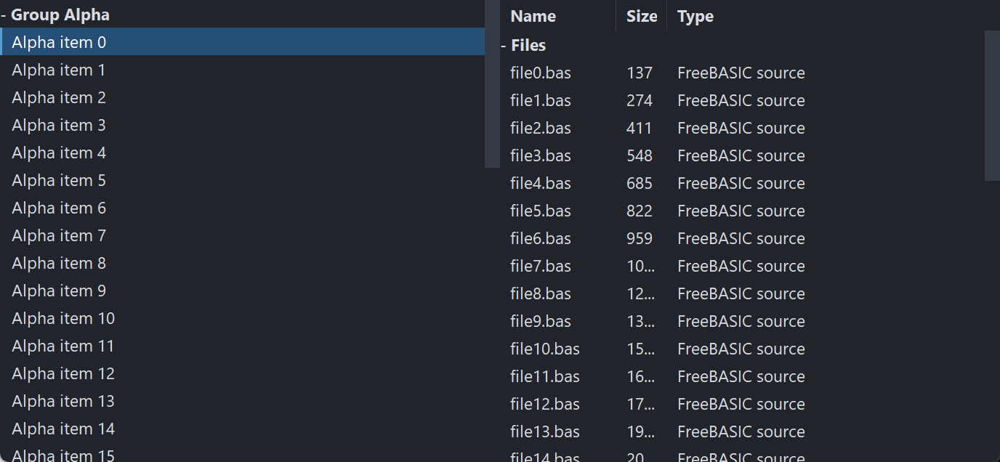

# PsListBox

An owner-drawn list box for FreeBASIC Win32 applications: a scrolling list of fixed-height
rows that you paint yourself, with collapsible group headers, single / multiple / extended
selection, per-row tooltips, and an optional multi-column report mode driven by a resizable
header band.

It is the control you reach for when a system `LISTBOX` almost fits but its appearance does
not — a file explorer pane, a results list, a symbol browser, an autocomplete popup. There is
no system control underneath: the whole surface is drawn in one pass through a double buffer,
so nothing about the look depends on the visual style the user happens to be running.

The control owns three child windows for you — the row surface, an owner-drawn vertical
scrollbar that appears only while the rows overflow, and a column header band that starts
hidden. You never create or position any of them. What you supply is a row paint callback:
the control decides *which* rows are drawn, where they sit, and what state each is in, and you
decide what a row looks like.

Rows are addressed by **model index** — the order you added them. Collapsing a group hides
rows but never renumbers anything.

---

## What it looks like



Two instances. On the left a grouped single-column list — a collapsible group header, one selected row, and rows that keep their selection across a collapse. On the right the same control in report mode: a `PsColumnHeader` band (Name / Size / Type), a group row, and an embedded `PsVScrollBar` down the right edge. Public indices in both are **model** indices; the visible index space never leaks out.

---

## Requirements

**Files to copy into your project:**

| File | Purpose |
|---|---|
| `PsListBox.bi` | Declarations — types, callbacks, constants, function prototypes |
| `PsListBox.inc` | Implementation |
| `PsColumnHeader.bi` / `.inc` | The column header band the control embeds — see [PsColumnHeader.md](PsColumnHeader.md) |
| `PsVScrollBar.bi` / `.inc` | The vertical scrollbar the control embeds |
| `PsBufferPaint.bi` / `.inc` | The flicker-free drawing surface everything paints through |

All six files are required even if you never define a column and never touch the scrollbar:
the control creates both children unconditionally.

**AfxNova is required.** The control is built on `CWindow`, and `PsBufferPaint` draws through
`AfxNova\CGdiPlus.inc`. Sources include AfxNova relative to the workspace root
(`#include once "AfxNova\CWindow.inc"`), so builds need the workspace root on the include
path:

```bash
fbc64.exe -i "C:\dev" main.bas
```

**Include order — this one bites.** `PsListBox.bi` includes only `PsBufferPaint.bi`. It does
**not** include `PsVScrollBar.bi` or `PsColumnHeader.bi`, yet it names types from both:
`CVSCROLL_DEFAULT_WIDTH` and `VScrollPaintCallbackSub` from the scrollbar, and
`HDR_WidthChangedCallbackSub`, `HDR_ClickCallbackSub`, `HDR_AutoSizeCallbackFunc`,
`HDR_PaintCallbackSub` and `HDR_TooltipCallbackFunc` from the header. It therefore compiles
only at an include site that has already pulled those two in. Include the four implementation
files in exactly this order:

```freebasic
#include once "PsBufferPaint.inc"
#include once "PsVScrollBar.inc"
#include once "PsColumnHeader.inc"
#include once "PsListBox.inc"
```

Get the order wrong and the errors point at `PsListBox.bi`, naming types rather than the
missing include.

The AfxNova headers come first, before any of the above:

```freebasic
#include once "windows.bi"
#include once "AfxNova\CWindow.inc"
#include once "AfxNova\AfxStr.inc"
#include once "AfxNova\AfxGdiplus.inc"
using AfxNova
```

**GDI+ must be running before the first repaint and must outlive the last one.** All geometry
is rendered through GDI+, so bracket your message loop:

```freebasic
dim as ULONG_PTR gdipToken = AfxGdipInit()
' ... create windows, run the message loop ...
AfxGdipShutdown( gdipToken )
```

`AfxGdipShutdown` must come after every window is destroyed, because each repaint builds and
tears down a `PsBufferPaint`.

**Never name an identifier `ok`.** GDI+ defines `Ok = 0` as a `Status` enum value in namespace
`AfxNova`, and hosts customarily say `using AfxNova`. An existing variable, parameter or
function called `ok` becomes a duplicate definition the moment you adopt these files. Use
`bOK` instead.

**There is no message-pump filter.** Neither this control nor the header nor the scrollbar
installs one; there is no `PsListBox_FilterMessage` to call. The only pump requirement is the
ordinary dialog-manager one below.

**For Tab navigation, call `IsDialogMessage` in your message pump.** The row surface is a
tabstop, and the container declares itself a control parent, so the dialog manager will step
into the control — but only if you give it the chance:

```freebasic
do while GetMessage( @uMsg, null, 0, 0 )
    if uMsg.message = WM_QUIT then exit do
    if IsDialogMessage( hWndForm, @uMsg ) = 0 then
        TranslateMessage @uMsg
        DispatchMessage @uMsg
    end if
loop
```

Without it, mouse operation and the keyboard are unaffected once the list has focus — only Tab
navigation is lost. The arrow keys are safe either way: the surface answers `WM_GETDLGCODE`
with `DLGC_WANTARROWS or DLGC_WANTCHARS`, so `IsDialogMessage` does not steal them for
tab-navigation.

**Give something the focus at startup.** `IsDialogMessage` acts only when the focused window is
already a descendant of the window you pass it. A real dialog does this in `WM_INITDIALOG`; an
ordinary window must call `SetFocus` on its first control itself. Skip it and the first Tab
does nothing, which is indistinguishable from the tabstops being broken. Clicking the list also
gives it focus, so this only affects a keyboard-first start.

---

## Quick start

```freebasic
' Create it. The control is created zero-sized and hidden; place it yourself.
dim as HWND hList = PsListBox_Create( hWndParent, IDC_MYFORM_LIST )
SetWindowPos( hList, 0, x, y, cx, cy, SWP_NOZORDER or SWP_SHOWWINDOW )

' You MUST supply a row painter -- without one, rows are not drawn at all.
PsListBox_SetPaintCallback( hList, @MyList_PaintRow )

' Optional: observe mouse messages, supply tooltips, hear about selection moves.
PsListBox_SetMessageCallback( hList, @MyList_Message )
PsListBox_SetTooltipCallback( hList, @MyList_Tooltip )
PsListBox_SetSelChangeCallback( hList, @MyList_SelChange )

' Appearance. The font is borrowed -- you keep ownership and destroy it yourself.
PsListBox_SetBackColor( hList, theme.BackColor )
PsListBox_SetFont( hList, ghFont(GUIFONT_10) )
PsListBox_SetScrollBarColors( hList, theme.BackColorScrollBar, _
                             theme.ForeColorScrollBar, theme.ForeColorScrollBarHot )

' Selection mode. Both off = single-select.
PsListBox_SetExtendedSelect( hList, true )     ' Shift ranges / Ctrl toggles

' Bulk load, batched: one map rebuild and one repaint instead of one per row.
PsListBox_BeginUpdate( hList )
PsListBox_AddHeader( hList, "Group Alpha" )
for i as integer = 0 to 20
    PsListBox_AddString( hList, "Alpha item " & i, 1000 + i )
next
PsListBox_EndUpdate( hList )

' Silent -- the SelChange callback does not fire for this.
PsListBox_SetCurSel( hList, 1 )
```

And the row painter:

```freebasic
sub MyList_PaintRow( byval p as PSLISTBOX_PAINTINFO ptr )
    ' State priority is yours to choose: selected > hot > normal is the usual one.
    dim as COLORREF backclr, foreclr
    if p->isSelected then
        backclr = theme.BackColorSelect : foreclr = theme.ForeColorSelect
    elseif p->isHot then
        backclr = theme.BackColorHot    : foreclr = theme.ForeColorHot
    else
        backclr = theme.BackColor       : foreclr = theme.ForeColor
    end if
    p->b->SetForeColor( foreclr )
    p->b->SetBackColor( backclr )
    p->b->PaintRect( @p->rc )          ' the whole row: selection spans it

    if p->isHeader then
        dim as DWSTRING wszPrefix
        if p->isCollapsed then wszPrefix = "+ " else wszPrefix = "- "
        p->b->SetFont( ghFont(GUIFONTBOLD_10) )
        p->b->PaintText( wszPrefix & p->wszCaption, @p->rc, DT_LEFT )
    else
        dim as RECT rcText = p->rc
        rcText.left += 16
        p->b->PaintText( p->wszCaption, @rcText, DT_LEFT )
    end if
end sub
```

That is the whole minimum. To turn on report mode, add columns and show the band:

```freebasic
PsListBox_AddColumn( hList, "Name", 160 )
PsListBox_AddColumn( hList, "Size", 70 )
PsListBox_AddColumn( hList, "Type" )              ' the fill column (default: the last)
PsListBox_SetHeaderPaintCallback( hList, @MyHeader_PaintColumn )
PsListBox_SetHeaderBackColor( hList, theme.BackColorScrollBar )
PsListBox_SetHeaderFont( hList, ghFont(GUIFONTBOLD_10) )
PsListBox_ShowHeader( hList, true )

' Cell text: column 0 IS the row's text; columns 1..N are per-row cells.
dim as integer r = PsListBox_AddString( hList, "file0.bas" )
PsListBox_SetCellText( hList, r, 1, "137" )
PsListBox_SetCellText( hList, r, 2, "FreeBASIC source" )
```

Your row painter then sees `p->columnCount > 0` and a `p->cells` array — fill the full row
background first, then draw each cell inside its own rect:

```freebasic
dim as integer pad = PsColumnHeader_GetPadding( PsListBox_GetHeader( hList ) )
for c as integer = 0 to p->columnCount - 1
    dim as RECT rcCell = p->cells[c].rc
    rcCell.left += pad : rcCell.right -= pad
    p->b->PaintText( p->cells[c].wszText, @rcCell, DT_LEFT or DT_END_ELLIPSIS )
next
```

---

## Concepts

### The handle is a real HWND

`PsListBox_Create` returns an ordinary window handle, and every `PsListBox_*` function takes it.
It is not an opaque type, so you can treat the control as the window it is — `SetWindowPos` to
place and size it, `ShowWindow` to show it, `GetDlgItem` to find it by the `CtrlID` you passed
at creation.

That handle is the **container**. It hosts three children: the row surface, the scrollbar and
the header band. Every function resolves them internally. Never pass a child handle to a
`PsListBox_*` function — results are undefined.

The children take consecutive control ids: the surface gets `CtrlID`, the scrollbar
`CtrlID + 1`, the header `CtrlID + 2`. Leave that much room around whatever id you pick.

### It is created zero-sized and hidden

`PsListBox_Create` gives the container the styles `WS_CHILD`, `WS_CLIPSIBLINGS` and
`WS_CLIPCHILDREN`. `WS_VISIBLE` is deliberately absent, so a newly created control shows
nothing until you size it and show it. That lets you build and configure the list — colours,
font, columns, contents — before it is ever seen.

### Row indices are model indices

Rows are addressed by the order they were added, independent of what is on screen. Collapsing a
group does **not** renumber anything, and hidden rows keep working with every row API,
selection included. Internally the control maps model rows to visible positions; that mapping
never leaks out. Everything you receive — `PSLISTBOX_PAINTINFO.itemID`,
`PSLISTBOX_MESSAGEINFO.idx`, `PsListBox_GetCurSel`, `PsListBox_GetSelItems`,
`PsListBox_GetTopIndex` — is a model index too.

`PsListBox_GetCount` is every row in the model. `PsListBox_GetVisibleCount` is the rows currently
on show. They differ exactly when something is collapsed.

### Groups are flat

A row is either a header (`PsListBox_AddHeader`) or an item (`PsListBox_AddString`). Items belong
to the nearest preceding header. There is **one level** — headers do not nest. Collapsing a
header hides its items until the next header.

Headers are ordinary rows in every other respect: they are selectable, they are returned by
`PsListBox_GetSelItems`, and they carry `itemData`. Use `PsListBox_IsHeader` to tell them apart.

Clicking a header toggles its group and **leaves the selection alone** — it is a fold gesture,
not a select.

### Selection lives on the rows

Selection is a per-row flag in the model, not a bit inside a system listbox. That is what makes
it survive collapse and expand, and it is why a hidden row can be selected. Three modes, and
the two flags are mutually exclusive:

| Mode | How to get it | Mouse behaviour |
|---|---|---|
| Single | both off (the default) | Each click selects exactly one row |
| Extended | `PsListBox_SetExtendedSelect( h, true )` | Shift extends a range from the anchor, Ctrl toggles one row |
| Multiple | `PsListBox_SetMultiSelect( h, true )` | Every click toggles one row, checklist style |

Setting either mode clears the other. `PsListBox_GetCurSel` reports the **focused** row (the
caret), which is not the same as "the selection" once more than one row can be selected — use
`PsListBox_GetSelItems` for that.

### Everything is painted in one pass

One `WM_PAINT` on the surface fills the whole client with `BackColor` and then calls your paint
callback once per visible row, all into a single buffer. There is no per-row message and no
per-row buffer.

`p->rc` and the cell rects are in the **surface's client coordinates**, not in a row-sized
buffer starting at y = 0. Derive everything from `p->rc` and you never have to care.

Rows below the last one are not painted at all; the control's background already covers that
strip, which is why an empty list needs no special handling from you.

**If you set no paint callback, no rows are drawn** — only the background. That is the one
callback the control genuinely needs.

### The scrollbar manages itself

The control creates a `PsVScrollBar`, positions it on the right edge, keeps its range in step
with the model, and **auto-hides it whenever the rows fit** — at which point the row surface
reclaims the full client width. You never call `SetRange` or `SetPos`.

What is left to you is appearance: `PsListBox_SetScrollBarWidth`,
`PsListBox_SetScrollBarColors`, `PsListBox_SetScrollBarPaintCallback`, or
`PsListBox_GetScrollBar` for direct `PsVScrollBar_*` calls.

The mouse wheel is handled on the row surface, not by the bar: one notch scrolls
`SPI_GETWHEELSCROLLLINES` rows (re-read per message, and capped at one page), with the
sub-notch remainder accumulated so a precision touchpad scrolls smoothly rather than in jumps.
The thumb follows.

### Columns are optional, and the header band owns them

With no columns defined, the control paints as a single-column list and your painter sees
`p->columnCount = 0`.

Define columns and one thing changes: item rows arrive with a `cells` array giving each
column's x-span. **Group-header rows never get cells** — they always span the full width, so
`columnCount` is 0 for them regardless.

The column model lives in the embedded `PsColumnHeader`, which is the single store for widths,
minimums and the fill designation. The `PsListBox_*Column*` functions are wrappers that delegate
to it. See [PsColumnHeader.md](PsColumnHeader.md) for the width, minimum-width and fill rules.

**Column definitions and cell text are independent.** Cell storage is sparse and per row, so
you can populate rows before or after defining columns; a cell never set reads back `""`. The
band itself starts **hidden** — columns still lay out and rows still paint in columns, you
simply get no interactive header strip until `PsListBox_ShowHeader( h, true )`.

The header band spans the **full container width**, over the scrollbar strip, so column
geometry never shifts when the scrollbar auto-hides.

### Column 0 is the row's text

`PsListBox_GetText`/`SetText` and the cell functions with `col = 0` address the same storage.
Columns 1..N live in the row's own sparse cell array. This is why a list written before columns
existed keeps working unchanged.

Inserting or deleting a column shifts every row's cell storage across that alias — insert a
column at 0 and each row's text becomes its column 1 cell.

### Batch bulk changes

Every model mutator rebuilds the visible map and repaints. Wrap a bulk load in
`PsListBox_BeginUpdate` / `PsListBox_EndUpdate` and that collapses to one rebuild and one
repaint, turning an O(n²) load into O(n). The pairs nest.

### Programmatic changes are silent

`PsListBox_SetCurSel`, `SetSel`, `SelectAll` and `Clear` never fire the SelChange callback. It
reports **user** action only — a click, or a keyboard move. This follows Win32's own
`LB_SETCURSEL` / `LBN_SELCHANGE` split, and it means you can call the setters from inside your
own handler without recursing.

The same rule holds for column widths: `PsListBox_SetColumnWidth` repaints but fires no resize
callback. Only a user drag or an autosize notifies.

### Pixels, and who scales them

| Setting | Unit | Default |
|---|---|---:|
| Row height (`PsListBox_SetRowHeight`) | **Unscaled** — DPI-scaled internally | 22 |
| Header height (`PsListBox_SetHeaderHeight`) | **Unscaled** — DPI-scaled internally | 24 |
| Scrollbar width (`PsListBox_SetScrollBarWidth`) | **Unscaled** — DPI-scaled at layout | 12 |
| Column widths and minimums | **Pixels**, used as given | 100 / 0 |
| Header caption padding | **Pixels** after create; the default is DPI-scaled at create | 8 |

Row height and header height are the trap in both directions: hand them a value you have
already scaled and it gets scaled twice.

### Keyboard

The row surface handles these itself and consumes them, so they never reach the message
callback:

| Key | Action |
|---|---|
| Up / Down | Move the focus one visible row |
| PageUp / PageDown | Move the focus one page |
| Home / End | First / last visible row |
| Left | Collapse an expanded header; from an item, jump to its header |
| Right | Expand a collapsed header; from an expanded one, step to the first child |
| Space | Toggle the focus row's selection (multiple / extended), or select it (single) |

Shift and Ctrl modify the arrow and page moves the same way they modify a click. Because
`WM_KEYDOWN` never reaches the message callback, **`SelChangeCallback` is the only way to
observe keyboard navigation.**

Every move ensures the new focus row is on screen.

### Hover, tooltips and focus

Exactly one row is hot at a time. Hover state is cleared both by `WM_MOUSELEAVE` and by a
100 ms cursor poll, because `WM_MOUSELEAVE` is not reliably delivered on fast exits.

Tooltips are resolved on demand: with no tooltip callback the hovered row's own text is used;
with one, whatever it returns, and `""` suppresses the tip entirely. The tip is popped when the
hot row changes so the next hover re-queries.

A left click calls `SetFocus` on the row surface **before** your message callback runs. If the
list must not hold focus — an autocomplete popup over an editor, say — put the focus back from
your callback.

### Lifetime

The control frees itself, its tooltip and all three children when its window is destroyed.
Fonts you pass in stay yours: the control stores the `HFONT` and never destroys it.

---

## Behaviour and limits

Firm properties of the control, not settings:

- **Nothing is drawn without a paint callback.** The background is filled, and that is all.
- **All rows are the same height.** There is no per-row height, so a group header cannot be
  taller than its items.
- **Groups do not nest.** One level of headers, and a group runs to the next header.
- **Text setters do not repaint.** `PsListBox_SetText`, `SetCellText`, `SetItemData` and
  `SetItemDataExtra` change the model and return — they do not invalidate. Call
  `PsListBox_Refresh` after changing text on a list that is already on screen.
- **`PsListBox_SetBackColor` does not repaint either.** It stores the colour and returns the
  previous one. Set it before showing the control, or follow it with `PsListBox_Refresh`.
- **Group-header rows never receive cells.** They span the full width even in report mode, so
  `columnCount` is 0 for them.
- **The control does not clip between cells.** Cell rects are handed to you as computed;
  drawing text wider than its cell will spill into the next one. `DT_END_ELLIPSIS` is the
  answer.
- **The control never sorts.** `PsListBox_SetColumnClickCallback` is the hook; reordering the
  rows is yours.
- **The `cells` pointer is valid only during the paint callback.** It points at control-owned
  scratch reused for every row. Copy anything you need to keep.
- **Cell text survives `PsListBox_ClearColumns`.** Clearing column *definitions* does not clear
  row *data* — the two are deliberately independent.
- **`PsListBox_GetColumnWidth` on the fill column returns its laid-out width**, not the stored
  one. Setting a width on the fill column stores it but has no visual effect until that column
  stops being the fill.
- **The message callback's return value has no effect for the button messages.** For
  `WM_LBUTTONDOWN`, `WM_LBUTTONUP`, `WM_RBUTTONDOWN` and `WM_LBUTTONDBLCLK` the surface
  consumes the message either way, and for the button-down the control's own selection or
  collapse handling has **already run** by the time you are called. Returning TRUE suppresses
  `DefWindowProc` only for `WM_MOUSEMOVE`, `WM_MOUSEHOVER`, `WM_MOUSELEAVE` and
  `WM_MOUSEWHEEL`.
- **`PSLISTBOX_MESSAGEINFO.idx` is filled only for the button and hover messages.** It stays -1
  for `WM_MOUSEMOVE`, `WM_MOUSELEAVE` and `WM_MOUSEWHEEL`.
- **Clicks that land below the last row do not reach the message callback at all**, for any
  button message.
- **The wheel is reported only when it actually scrolls.** A wheel gesture against the end of
  the list does not call the message callback.
- **The header band's own `WidthChanged` slot belongs to the control.** Subscribe with
  `PsListBox_SetColumnResizeCallback`, never with `PsColumnHeader_SetWidthChangedCallback` on the
  handle from `PsListBox_GetHeader`. Every other header callback passes straight through.
- **No horizontal scrolling.** Columns wider than the client run off the right edge and are
  clipped there.
- **No in-place editing, no drag-reorder of rows, no checkbox column, no icons.** Anything of
  that kind is drawn by your painter and driven by your message callback.

---

## API reference

Every function takes the handle from `PsListBox_Create` as its first argument, written `h` in
the tables below.

### Creation

| Function | Description |
|---|---|
| `PsListBox_Create( hWndParent, CtrlID ) as HWND` | Creates the control as a child of `hWndParent` and returns the container's handle. `CtrlID` becomes its `GWLP_ID`; the three children take `CtrlID`, `CtrlID + 1` and `CtrlID + 2`. Created zero-sized and hidden — place it with `SetWindowPos`. |

### Content

`Add*` and `Insert*` return the new row's **model index**, or -1 on failure.

| Function | Description |
|---|---|
| `PsListBox_AddString( h, Text, itemData = 0, itemDataExtra = 0 ) as integer` | Appends an item row. |
| `PsListBox_AddHeader( h, Text, itemData = 0, itemDataExtra = 0 ) as integer` | Appends a group-header row. Items added after it belong to this group until the next header. |
| `PsListBox_InsertString( h, row, Text, itemData = 0, itemDataExtra = 0 ) as integer` | Inserts an item at `row`, shifting later rows down. `row` is clamped to `[0, count]` and the index actually used is returned. Inserts an **item**, never a header. |
| `PsListBox_DeleteString( h, row ) as boolean` | Deletes the row. FALSE for an invalid index. |
| `PsListBox_Clear( h )` | Removes every row. Also resets the focus and anchor rows to -1, so a stale caret cannot survive into the next list. Silent. |
| `PsListBox_GetCount( h ) as integer` | Every row in the model. |
| `PsListBox_GetVisibleCount( h ) as integer` | Rows currently on show — headers plus the items of expanded groups. |
| `PsListBox_GetText( h, row ) as DWSTRING` | The row's text, which is also its column 0 cell. `""` for an invalid row. |
| `PsListBox_SetText( h, row, Text ) as boolean` | Sets it. FALSE for an invalid row. **Does not repaint** — call `PsListBox_Refresh` if the list is on screen. |
| `PsListBox_GetCellText( h, row, col ) as DWSTRING` | Column `col`'s text for that row. `col = 0` is the row's own text. A cell never set — and any `col` beyond what the row stores — reads `""`, as does a negative `col`. |
| `PsListBox_SetCellText( h, row, col, Text ) as boolean` | Sets it, growing the row's sparse cell storage as needed. FALSE for an invalid row or a negative `col`. A `col` beyond the defined columns is legal storage: it simply paints once a matching column exists. **Does not repaint.** |
| `PsListBox_GetItemData( h, row ) as integer` | The row's user value. 0 for an invalid row. |
| `PsListBox_SetItemData( h, row, itemData ) as boolean` | Sets it. FALSE for an invalid row. **Does not repaint.** |
| `PsListBox_GetItemDataExtra( h, row ) as integer` | The row's second user value. |
| `PsListBox_SetItemDataExtra( h, row, itemDataExtra ) as boolean` | Sets it. FALSE for an invalid row. **Does not repaint.** |
| `PsListBox_BeginUpdate( h )` | Suspends the rebuild-and-repaint that every model mutator would otherwise do. Nests. |
| `PsListBox_EndUpdate( h )` | Ends one nesting level; the outermost one refreshes once. |
| `PsListBox_Refresh( h )` | Rebuilds the visible map, re-derives the scroll position and the scrollbar, and repaints with a background erase. |

### Groups

Collapse, expand and toggle act only on header rows and return FALSE for an item or an invalid
index.

| Function | Description |
|---|---|
| `PsListBox_IsHeader( h, row ) as boolean` | Is this row a group header? |
| `PsListBox_IsCollapsed( h, row ) as boolean` | Is this header collapsed? FALSE for an item. |
| `PsListBox_CollapseRow( h, row ) as boolean` | Collapses the group. TRUE for any header, whether or not it was already collapsed; only an actual change refreshes. |
| `PsListBox_ExpandRow( h, row ) as boolean` | Expands the group, same convention. |
| `PsListBox_ToggleRow( h, row ) as boolean` | Flips it. |
| `PsListBox_CollapseAll( h ) as boolean` | Collapses every header in one refresh. |
| `PsListBox_ExpandAll( h ) as boolean` | Expands every header in one refresh. |

### Selection and state

| Function | Description |
|---|---|
| `PsListBox_GetCurSel( h ) as integer` | The **focused** row's model index, or -1. |
| `PsListBox_SetCurSel( h, row ) as integer` | Focuses `row`, selects only it, sets the anchor there, and scrolls it into view if it is off-page. Returns `row`. An invalid index instead clears the whole selection and the focus and returns -1. **Silent** — the SelChange callback does not fire. A row hidden under a collapsed header keeps the focus but does not scroll. |
| `PsListBox_GetSel( h, row ) as boolean` | Is that row selected? Works for hidden rows and headers. |
| `PsListBox_SetSel( h, row, state ) as boolean` | Sets one row's selected flag and repaints. FALSE for an invalid row. Does not move the focus. **Silent.** |
| `PsListBox_GetSelCount( h ) as integer` | How many rows are selected, hidden ones included. |
| `PsListBox_GetSelItems( h, selItems() ) as integer` | Redims `selItems()` to the model indices of every selected row, ascending, and returns the count. With nothing selected the array is erased and 0 returned. |
| `PsListBox_SelectAll( h, state )` | Sets every row's selected flag to `state` and repaints. **Silent.** |
| `PsListBox_SetMultiSelect( h, enable ) as boolean` | Checklist mode: every click toggles one row. Enabling it turns extended mode off. |
| `PsListBox_SetExtendedSelect( h, enable ) as boolean` | Explorer mode: Shift extends a range from the anchor, Ctrl toggles. Enabling it turns multiple mode off. |
| `PsListBox_PreventDoubleClick( h, enable = true ) as boolean` | Opts out of double-click reporting. With `CS_DBLCLKS` a double-click delivers down, up, **dblclk**, up — the dblclk substituting for the second down — so a host acting on `WM_LBUTTONUP` acts twice. Enabled, the dblclk still applies the ordinary click to the model (selection, header toggle) but is never surfaced, and the trailing second up is swallowed too: you see exactly one down/up pair per double-click. |
| `PsListBox_GetTopIndex( h ) as integer` | The model index of the first displayed row, or -1 when nothing is visible. |
| `PsListBox_SetTopIndex( h, row ) as integer` | Scrolls so `row` is at the top. A row hidden under a collapsed header resolves to its group header, so any valid model row may be passed without checking collapse state. The scroll is clamped — never past the point where the last row sits at the bottom of the viewport — and the **clamped** result is returned. -1 for an invalid row. |

### Appearance

| Function | Description |
|---|---|
| `PsListBox_GetBackColor( h ) as COLORREF` | The colour behind the rows, including the strip below the last one. |
| `PsListBox_SetBackColor( h, clr ) as COLORREF` | Sets it and returns the previous value. **Does not repaint** — set it before showing, or follow with `PsListBox_Refresh`. |
| `PsListBox_GetRowHeight( h ) as integer` | The row height in **unscaled** units. |
| `PsListBox_SetRowHeight( h, height ) as integer` | Sets it and returns what you passed. Unscaled units — the control DPI-scales it, so do not pre-scale. Repaints and re-syncs the scrollbar, since rows-per-page changed. The scaled result is floored at 1 pixel. |
| `PsListBox_GetFont( h ) as HFONT` | The font selected into the buffer before each row callback. |
| `PsListBox_SetFont( h, hFont ) as boolean` | Sets it and repaints. **Borrowed, never owned** — keep it alive and destroy it yourself. Your paint callback may select a different font per row. |
| `PsListBox_SetHoverTime( h, milliseconds )` | How long the cursor must rest on a row before `WM_MOUSEHOVER` and the tooltip. Default 250. |

### Scrollbar

Nothing here is required; the control creates, positions, ranges and auto-hides the bar itself.

| Function | Description |
|---|---|
| `PsListBox_GetScrollBar( h ) as HWND` | The scrollbar child, for direct `PsVScrollBar_*` calls. |
| `PsListBox_SetScrollBarWidth( h, nWidth )` | Track width in **unscaled** units, DPI-scaled at layout. Clamped to a minimum of 1. Re-lays out immediately. |
| `PsListBox_SetScrollBarColors( h, backclr, foreclr, foreclrhot )` | Track background, thumb, and thumb-under-cursor. |
| `PsListBox_SetScrollBarPaintCallback( h, usersub )` | Installs a `VScrollPaintCallbackSub` that draws the bar instead of its built-in painter. |

### Columns and the header band

All optional. Widths and minimum widths are **pixels**; see [PsColumnHeader.md](PsColumnHeader.md)
for the layout rules these delegate to.

| Function | Description |
|---|---|
| `PsListBox_AddColumn( h, Text, nWidth = 100, nMinWidth = 0, itemData = 0 ) as integer` | Appends a column and returns its index, or -1. `nMinWidth = 0` means the control's own scaled floor applies. |
| `PsListBox_InsertColumn( h, idx, Text, nWidth = 100, nMinWidth = 0, itemData = 0 ) as integer` | Inserts at `idx` (clamped to `[0, count]`) and returns the index used. **Shifts every row's cell storage** to match, across the column-0 / row-text alias. |
| `PsListBox_DeleteColumn( h, idx ) as boolean` | Deletes the column and shifts every row's cells down. Deleting column 0 promotes each row's column 1 cell to its text. FALSE for a bad index. |
| `PsListBox_ClearColumns( h )` | Removes every column definition. Row **cell text is untouched** and reappears if columns are defined again. |
| `PsListBox_GetColumnCount( h ) as integer` | How many columns are defined. |
| `PsListBox_GetColumnText( h, idx ) as DWSTRING` | The column's caption. |
| `PsListBox_SetColumnText( h, idx, Text ) as boolean` | Sets it and repaints that header cell only — row cells are unaffected. FALSE for a bad index. |
| `PsListBox_GetColumnWidth( h, idx ) as integer` | The column's width in pixels, already raised to its effective minimum. For the fill column this is the **laid-out** width, not the stored one. |
| `PsListBox_SetColumnWidth( h, idx, nWidth ) as boolean` | Stores the width, clamped up to the column's effective minimum, and repaints the rows. **Silent** — no resize callback. On the fill column the value is stored but has no visual effect until that column stops being the fill. |
| `PsListBox_GetColumnMinWidth( h, idx ) as integer` | The column's own stored minimum. 0 means "use the control default". |
| `PsListBox_SetColumnMinWidth( h, idx, nMinWidth ) as boolean` | Sets it; negatives become 0. Re-lays out and repaints. |
| `PsListBox_GetFillColumn( h ) as integer` | The **resolved** index of the column that absorbs leftover width, or -1 if none. |
| `PsListBox_SetFillColumn( h, idx ) as boolean` | Takes a column index, `CCOLHDR_FILL_LAST` (the default) or `CCOLHDR_FILL_NONE`. FALSE for an index that is neither valid nor one of those two constants. |
| `PsListBox_ShowHeader( h, bShow = true ) as boolean` | Shows or hides the interactive header strip. Hidden is the default; columns lay out and rows paint in columns either way. Changes the surface height, so it re-lays out and re-syncs the scrollbar. |
| `PsListBox_IsHeaderVisible( h ) as boolean` | Is the band currently shown? |
| `PsListBox_GetHeaderHeight( h ) as integer` | Band height in **unscaled** units. |
| `PsListBox_SetHeaderHeight( h, height ) as integer` | Sets it, clamped to a minimum of 1, and returns the clamped value. Unscaled units — do not pre-scale. |
| `PsListBox_GetHeader( h ) as HWND` | The header child, for direct `PsColumnHeader_*` calls (padding, hit-tests, theming). **Do not set its WidthChanged callback** — that slot belongs to this control. |

### Callback registration

| Function | Description |
|---|---|
| `PsListBox_SetPaintCallback( h, usersub )` | Installs the row painter. **Required** — no rows are drawn without one. |
| `PsListBox_SetMessageCallback( h, userfunc )` | Installs an observer for the mouse messages. |
| `PsListBox_SetTooltipCallback( h, userfunc )` | Installs the on-demand tooltip text supplier. Unset, the row's own text is used. |
| `PsListBox_SetSelChangeCallback( h, usersub )` | Installs the handler told when the **user** moves the selection, by mouse or keyboard. |
| `PsListBox_SetColumnResizeCallback( h, usersub )` | Installs the handler told when the **user** resizes a column. This is the correct door — the header's own slot is taken. |
| `PsListBox_SetColumnClickCallback( h, usersub )` | Installs the completed-click-on-a-column-body handler. Passes straight through to the header. |
| `PsListBox_SetColumnAutoSizeCallback( h, userfunc )` | Installs the divider-double-click best-fit measurer. Passes straight through. |
| `PsListBox_SetHeaderPaintCallback( h, usersub )` | Installs the per-column header cell painter. Passes straight through. |
| `PsListBox_SetHeaderTooltipCallback( h, userfunc )` | Installs the per-column tooltip text supplier. Passes straight through. |
| `PsListBox_SetHeaderBackColor( h, clr )` | The band's flat background. Passes straight through. |
| `PsListBox_SetHeaderFont( h, hFont )` | The band's font, borrowed not owned. Passes straight through. |

Passing 0 to any callback setter clears it.

---

## Colors

**There is no colour struct.** The control paints only its own background; every row pixel is
yours, drawn from whatever palette your host already has. That is deliberate — a list of this
kind is skinned by its host, and a fixed struct of row colours would only get in the way.

What the control itself owns:

| Setting | Paints |
|---|---|
| `PsListBox_SetBackColor` | The row surface's whole client, including the strip below the last row. Filled before any row callback runs, and the only thing painted when no callback is set |
| `PsListBox_SetScrollBarColors` — `backclr` | The scrollbar track |
| `PsListBox_SetScrollBarColors` — `foreclr` | The scrollbar thumb, idle |
| `PsListBox_SetScrollBarColors` — `foreclrhot` | The scrollbar thumb, cursor over it or dragging |
| `PsListBox_SetHeaderBackColor` | The header band's flat background, behind the column cells |

### Which colour wins

The control does not decide; it hands you the state flags and you resolve them. It **does**
guarantee what can be true at once, which is what makes a precedence order well defined:

```
isSelected   >   isHot   >   plain
```

with `isFocused` drawn as an accent **on top** of whichever of those applied, because the caret
row and the selection are different things once more than one row can be selected.

- **At most one row is `isHot`** at any moment, and it clears deterministically when the cursor
  leaves.
- `isHot` and `isSelected` can both be true — the cursor resting on a selected row.
- `isFocused` marks the caret row and is independent of `isSelected`: in checklist mode the
  arrow keys move the caret without selecting anything.
- `isHeader` and `isCollapsed` describe the row, not its mood. `isCollapsed` is meaningful only
  when `isHeader` is TRUE.

### What draws what

| Part | Drawn by |
|---|---|
| Surface background | The control, in `BackColor`, every repaint |
| Rows | **Your paint callback**, into the same buffer |
| Header band background | The header control, in its back colour |
| Header column cells | **Your header paint callback** |
| Scrollbar | The scrollbar's built-in painter, or your scrollbar paint callback |

In report mode, fill the **full row rect** first so selection and hover span the row
listview-style, then draw each cell inside `cells[i].rc`.

---

## Callbacks

The four `PsListBox` typedefs are **unprefixed** — `PaintCallbackSub`, `MessageCallbackFunc`,
`TooltipCallbackFunc` and `SelChangeCallbackSub` occupy those exact names. If you are combining
these files with other controls, that is a name collision to check for.

### Row paint

```freebasic
type PaintCallbackSub as sub( byval p as PSLISTBOX_PAINTINFO ptr )
```

Draws one row. Called once per visible row on every repaint, so keep it cheap. Paint through
`p->b` — the control's buffer for this repaint — and never touch a screen DC. The control has
already filled the client with `BackColor` and selected the control font into the buffer; you
may override the font per row.

`PSLISTBOX_PAINTINFO`:

| Field | Meaning |
|---|---|
| `itemID` | The row's **model** index |
| `b` | The control's `PsBufferPaint` for this repaint (borrowed, not owned) |
| `rc` | The row's rect, in the surface's client coordinates |
| `isHot` | The mouse is over this row. At most one row at a time |
| `isSelected` | The row is part of the selection |
| `isFocused` | The row holds the keyboard caret |
| `isHeader` | This is a group-header row |
| `isCollapsed` | Header rows only: its items are hidden |
| `wszCaption` | The row's text (column 0) |
| `columnCount` | Number of cells in `cells`, or **0** for a full-width row |
| `cells` | Array of `PSLISTBOX_CELLINFO`, or **null** for a full-width row |

`columnCount` is 0 and `cells` is null whenever the row should paint as one full-width cell:
no columns are defined, **or** the row is a group header. Test `columnCount > 0` and you have
covered both.

`PSLISTBOX_CELLINFO`:

| Field | Meaning |
|---|---|
| `iCol` | The column index |
| `rc` | The cell's rect — x from the header's column geometry, y spanning this row |
| `wszText` | The cell's text |

> **The `cells` array is control-owned scratch, valid only for the duration of the callback.**
> It is reused for every row. Copy anything you need to keep.

> **The control does not clip between cells.** Text wider than its cell spills into the next
> one; use `DT_END_ELLIPSIS`.

### Message

```freebasic
type MessageCallbackFunc as function( byval m as PSLISTBOX_MESSAGEINFO ptr ) as boolean
```

Observes mouse messages on the row surface. Return TRUE to suppress the control's remaining
handling of that message, FALSE to let it proceed.

`PSLISTBOX_MESSAGEINFO`:

| Field | Meaning |
|---|---|
| `hList` | The **row surface** window, not the container. `GetParent` gives you the control handle |
| `uMsg` | The message |
| `wParam` / `lParam` | Its parameters, unmodified |
| `idx` | The **model** row index under the mouse, or -1 |
| `isCtrl` | Ctrl was down when the message arrived |
| `isShift` | Shift was down |

Which messages arrive, and what the return value actually does:

| Message | `idx` | When it fires | Does TRUE do anything? |
|---|---|---|---|
| `WM_MOUSEMOVE` | always -1 | Every move over the surface | Yes — suppresses `DefWindowProc` |
| `WM_MOUSEHOVER` | the hovered row | Only when the cursor is resting **on a row** | Yes |
| `WM_MOUSELEAVE` | always -1 | The cursor left | Yes |
| `WM_MOUSEWHEEL` | always -1 | Only when the wheel actually **scrolled** the list | Yes — stops the message bubbling to the parent |
| `WM_LBUTTONDOWN` | the pressed row | Only when the press lands **on a row** | **No** |
| `WM_LBUTTONUP` | the released-over row | Only when the release lands on a row | **No** |
| `WM_RBUTTONDOWN` | the row under the cursor | Only over a row | **No** |
| `WM_LBUTTONDBLCLK` | the row under the cursor | Over a row, and not while `PsListBox_PreventDoubleClick` is on | **No** |

The button messages are consumed by the surface either way, which is why the return value
cannot change them. More importantly, **the control's own handling has already happened** by
the time `WM_LBUTTONDOWN` reaches you: focus has been taken, and the click's selection change
or header collapse has been applied. Treat this callback as an observer.

`WM_KEYDOWN` is **not** reported here — the surface consumes the navigation keys itself. Use
the SelChange callback.

### Tooltip

```freebasic
type TooltipCallbackFunc as function( byval hListControl as HWND, byval row as integer ) as DWSTRING
```

Supplies the tooltip text for a model row, on demand — called only when a tip is about to show.
Return `""` for no tooltip on that row. With no callback installed, the row's own text is used.
`hListControl` is the control handle, not the surface.

### Selection changed

```freebasic
type SelChangeCallbackSub as sub( byval hListControl as HWND, byval row as integer )
```

The **user** moved the selection — by clicking a row, or by moving the caret with the keyboard
(arrows, PageUp/Down, Home/End, Left to a header, Space). `row` is the model index of the newly
focused row, or -1 if there is none. Fires after the control's state is updated, so
`PsListBox_GetCurSel` already agrees.

This is the only way to observe **keyboard** navigation, because the control consumes
`WM_KEYDOWN` itself and it never reaches the message callback. A mouse-only host can keep using
`WM_LBUTTONUP` in the message callback instead.

It does **not** fire for `PsListBox_SetCurSel`, `SetSel`, `SelectAll` or `Clear`, which is what
makes those safe to call from inside this handler. Nor does it fire when the user re-selects
the row that is already current, or when a clamped arrow key does not actually move the caret —
only a real change notifies.

### Header callbacks

The five header callbacks registered through `PsListBox_Set*` use the `HDR_*` typedefs and are
documented in full in [PsColumnHeader.md](PsColumnHeader.md). Two notes specific to using them
through `PsListBox`:

- **`PsListBox_SetColumnResizeCallback` is the only correct door for resize notifications.** The
  header's own `WidthChanged` slot is taken by this control, which needs it to repaint the rows
  on every live drag before re-broadcasting to you.
- The `hHeader` parameter these callbacks receive is the **header** window, not the control.
  Use `GetParent` if you need the list.

---

## Constants

Defined in `PsListBox.bi`:

| Constant | Value | Meaning |
|---|---:|---|
| `IDT_CLISTBOX_HOTTRACK` | `&hCB01` | Timer id for the hover safety-net poll. Timer ids are per-window, so every instance shares it |
| `PSLISTBOX_HOTTRACK_MS` | 100 | How often that poll checks whether the cursor has left |

Defaults the control starts with:

| Setting | Default | Unit |
|---|---:|---|
| Row height | 22 | Unscaled units |
| Header band height | 24 | Unscaled units |
| Scrollbar width | 12 | Unscaled units |
| Hover time | 250 | Milliseconds |
| Header band visible | false | — |
| Selection mode | single | — |
| Column width / minimum width | 100 / 0 | Pixels |

The fill-column designations passed to `PsListBox_SetFillColumn` come from `PsColumnHeader.bi`:

| Constant | Value | Meaning |
|---|---:|---|
| `CCOLHDR_FILL_LAST` | -2 | The last column absorbs leftover width (the default) |
| `CCOLHDR_FILL_NONE` | -1 | No column absorbs it; the columns end where they end |

---

## Related controls

`PsListBox` creates and owns two other controls. You never create either one, and both are
destroyed with the list.

| Control | Role | Reached through |
|---|---|---|
| **PsColumnHeader** | The column model and the interactive header band. It is the single store for column widths, minimums, geometry and the fill designation — the `PsListBox_*Column*` functions all delegate to it. See [PsColumnHeader.md](PsColumnHeader.md) | `PsListBox_GetHeader` |
| **PsVScrollBar** | The owner-drawn vertical scrollbar, ranged and auto-hidden by the list | `PsListBox_GetScrollBar` |

Both handles are escape hatches for appearance and queries. Two things you must not do through
them: do not set the header's `WidthChanged` callback (use `PsListBox_SetColumnResizeCallback`),
and do not call `PsVScrollBar_SetRange` or `PsVScrollBar_SetScrollCallback` — the list owns the
range and the scroll notification, and overwriting either desynchronises the thumb from the
list.

`PsColumnHeader` also works standalone; it knows nothing about list boxes.
